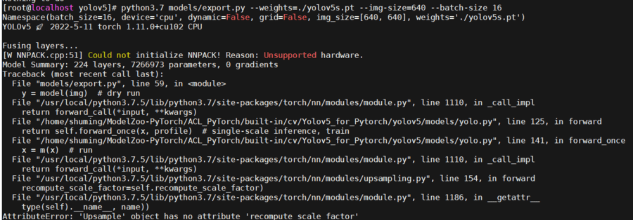
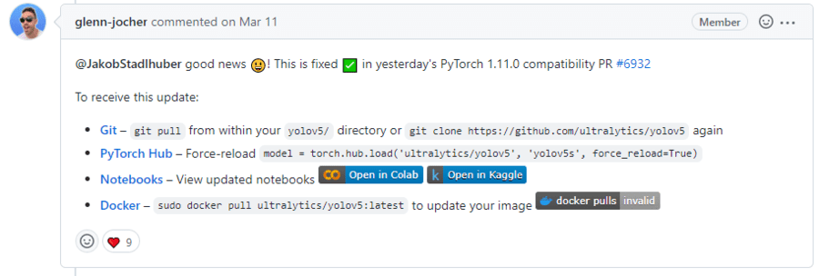
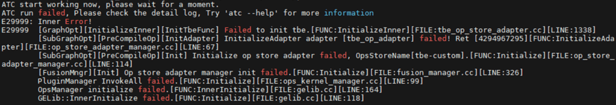
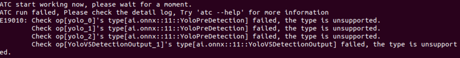
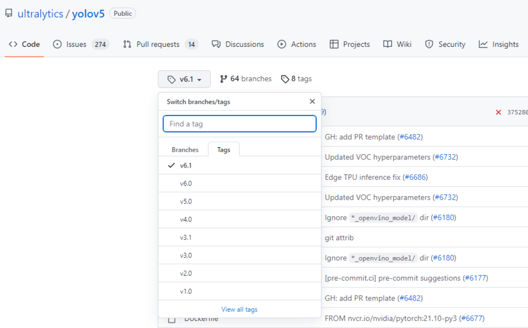
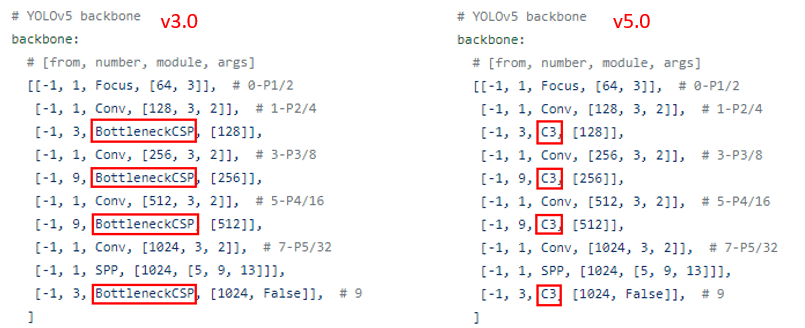
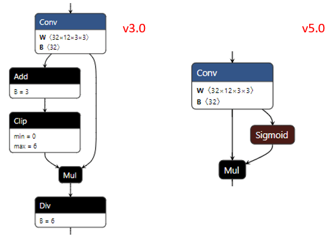
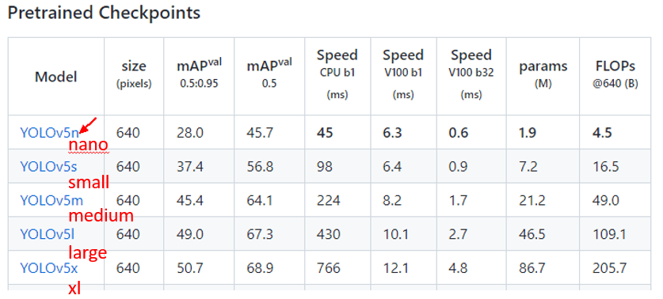
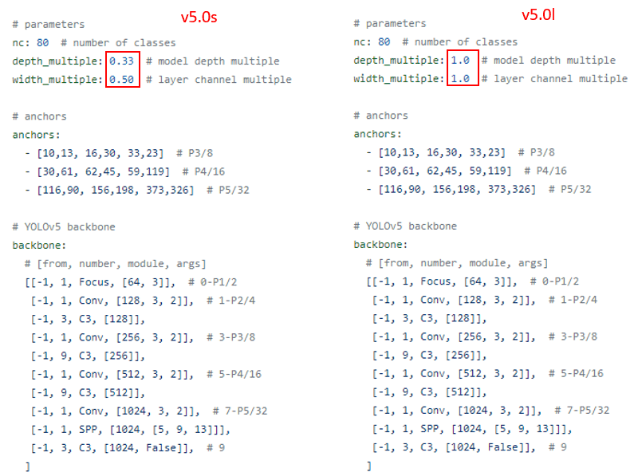

# FAQ
-   [版本问题](#版本问题)
-   [模型结构科普](#模型结构科普)
---

## 版本问题

1. pytorch源码导出onnx模型时报错，此处调用源码的export.py导出onnx模型，不成功多为模型加载/路径/版本等问题。 
 
**问题原因**：pytorch 1.11版本存在问题，该问题官网已有issue并修复，更换版本即可，开发版本：1.10.1。 
  

2. atc转模型失败—tbe初始化失败 
 
**问题原因**：python版本太低，升级>3.7，开发版本：Python3.7.5

3. atc转模型失败—算子不支持 
 
**问题原因**：使用CANN包版本较早，后处理算子还未合入，目前5.0.4及以后的CANN都是支持的，建议使用最新CANN包。

## 模型结构科普
### 1. YOLOv5众多版本（v1.0-v6.1）
[YOLOv5](https://github.com/ultralytics/yolov5/tree/v6.1) 作者为了模型更快更准，在优化道路上辛勤耕耘，衍生出一系列版本，如下：  
 

我们可以通过以下两种方式看看区别：  
1. [查看模型结构配置文件](https://github.com/ultralytics/yolov5/blob/v6.1/models/yolov5s.yaml) 
通过模型结构配置文件可以看出，整网是由各个子模块组合实现的，有兴趣可以看看 [common.py文件](https://github.com/ultralytics/yolov5/blob/v6.1/models/common.py) ，这里包含了各个子模块的代码实现。 
 
以v3.0和v5.0的配置文件为例，整网结构相同，其中子模块BottleneckCSP和C3不同。

2. [使用Netron工具打开模型](https://netron.app/) 
Netron用来可视化模型，我们再直观看下上述子模块有啥区别。 
 

**结论：不同版本的模型，整网结构相同，子模块不同。**

### 2. YOLOv5众多后缀（n/s/m/x/l）  
我们知道，模型优化可以通过结构创新，也可以试试重复多个子模块让模型更深更宽。在一定范围内增加参数量可带来更好的拟合效果，这个范围一般是实验得到的，超出该范围，参数量太少会欠拟合，参数量太多会过拟合。因此，YOLOv5作者提供了不同大小的模型及其结果对比，如下： 
 
同样，我们可以通过以下两种方式看看区别：  
1. [查看模型结构配置文件](https://github.com/ultralytics/yolov5/blob/v6.1/models/yolov5s.yaml) 
 
以v5.0的s和l配置文件为例，整网结构相同，参数depth_multiple和width_multiple用来控制子模块的重复个数不同。

2. [使用Netron工具打开模型](https://netron.app/)

**结论：相同版本不同大小的模型，整网结构相同且子模块相同，子模块个数不同。**