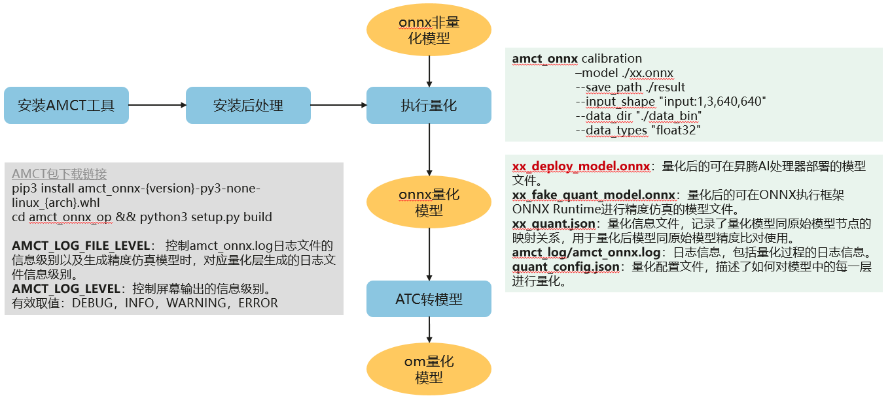

# Yolov5模型测试指导

-   [1 文件说明](#1-文件说明)
-   [2 设置环境变量](#2-设置环境变量)
-   [3 端到端推理步骤](#3-端到端推理步骤)
	-   [3.1 下载代码](#31-下载代码)
	-   [3.2 修改pytorch源码](#32-修改pytorch源码)
	-   [3.3 导出onnx模型并量化](#33-导出onnx模型并量化)
	-	[3.4 修改onnx模型](#34-修改onnx模型)
	-   [3.5 利用ATC工具转换为om模型](#34-利用ATC工具转换为om模型)
	-   [3.6 om模型推理](#35-om模型推理)

------

## 1 文件说明
将本仓库代码放在下载的 [yolov5开源仓](https://github.com/ultralytics/yolov5) 根目录下。
```
Yolov5_for_Pytorch
  ├── acl_net.py         PyACL接口封装脚本
  ├── amct.sh            onnx模型量化
  ├── atc.sh             onnx模型转om脚本
  ├── env.sh             设置环境变量
  ├── generate_data.py   生成量化校准数据脚本
  ├── img_info_amct.txt  生成量化校准数据所用的图片信息
  ├── map_calculate.py   mAP精度统计脚本
  ├── modify_model.py    onnx模型修改脚本
  ├── om_infer.py        推理导出的om模型
  ├── parse_json.py      coco数据集标签json文件解析脚本
  └── requirements.txt   脚本运行所需的第三方库
```

## 2 设置环境变量

```shell
source env.sh
```

## 3 端到端推理步骤

### 3.1 下载代码  
git clone 开源仓 https://github.com/ultralytics/yolov5 ，切换到所需tag。
```shell
git clone https://github.com/ultralytics/yolov5.git
cd yolov5
git checkout v5.0  # 切换到v5.0代码,支持v2.0->v6.0代码，对于v3.0版本请切换到bugfix版本，git checkout 4d7f222
```


### 3.2 修改pytorch源码

（1）修改models/common.py文件，对其中Focus的forward函数做修改，提升Slice算子性能
```python
class Focus(nn.Module):
    def forward(self, x):  # x(b,c,w,h) -> y(b,4c,w/2,h/2)
        # <==== 修改内容
        if torch.onnx.is_in_onnx_export():
            a, b = x[..., ::2, :].transpose(-2, -1), x[..., 1::2, :].transpose(-2, -1)
            c = torch.cat([a[..., ::2, :], b[..., ::2, :], a[..., 1::2, :], b[..., 1::2, :]], 1).transpose(-2, -1)
            return self.conv(c)
        else:
            return self.conv(torch.cat([x[..., ::2, ::2], x[..., 1::2, ::2], x[..., ::2, 1::2], x[..., 1::2, 1::2]], 1))
        # return self.conv(self.contract(x))
        # =====>
```

（2）修改models/yolo.py脚本，使后处理部分不被导出
```python

class Detect(nn.Module):
    def forward(self, x):
        # ...
        # <==== 修改内容
        self.training = True  # v6.0版本需补充该行
        # =====>
        for i in range(self.nl):
            x[i] = self.m[i](x[i])  # conv
            # <==== 修改内容
            if torch.onnx.is_in_onnx_export():
                continue
            # =====>
            bs, _, ny, nx = x[i].shape  # x(bs,255,20,20) to x(bs,3,20,20,85)
            x[i] = x[i].view(bs, self.na, self.no, ny, nx).permute(0, 1, 3, 4, 2).contiguous()
        # ...
```

（3）修改models/experimental.py文件，将其中的attempt_download()所在行注释掉
```python
def attempt_load(weights, map_location=None):
    # Loads an ensemble of models weights=[a,b,c] or a single model weights=[a] or weights=a
    model = Ensemble()
    for w in weights if isinstance(weights, list) else [weights]:
        # <==== 修改内容
        # attempt_download(w)  # v6.0中attempt_download(w)被下一行代码引用，修改如该处所示
        # =====>
        ckpt = torch.load(w, map_location=map_location)  # load
```

（4）修改models/export.py文件，将转换的onnx算子版本设为11，v6.0无需修改
```python
torch.onnx.export(model, img, f, verbose=False, opset_version=11, input_names=['images'], do_constant_folding=True,
                  output_names=['classes', 'boxes'] if y is None else ['output'])
                  dynamic_axes={'images': {0: 'batch'},
                                'output': {0: 'batch'}} if opt.dynamic else None)
```

### 3.3 导出onnx模型并量化
（1）下载对应的权重文件置于yolov5目录下，运行脚本导出模型
```shell
export PYTHONPATH=`pwd`:$PYTHONPATH
python3.7 models/export.py --weights=./yolov5s.pt --img-size=640 --batch-size 1  # 用于v2.0->v5.0
python3.7 export.py --weights=./yolov5s.pt --imgsz=640 --batch-size=1 --opset=11  # 用于v6.0
```
示例代码导出为静态shape模型，若增加--dynamic参数，导出动态shape模型。

（2）对导出的onnx模型使用onnx-simplifier工具进行简化
```shell
python3.7 -m onnxsim yolov5s.onnx yolov5s_sim.onnx
```
若步骤（1）导出动态shape模型，使用onnxsim简化时要增加传参：  
--dynamic-input-shape：说明导出模型为动态shape  
--input-shape images:1,3,640,640：设置shape的缺省值，若onnxsim不支持动态shape模型简化，则使用该值导出静态shape模型  


（3）生成量化所需的校准数据（可选）
```shell
python3.7 generate_data.py --img_info_file=img_info_amct.txt --save_path=amct_data --batch_size=1
```
参数说明：  
--img_info_file：生成量化校准数据所用的图片信息，根据实际数据集修改用于量化的图片信息  
--save_path：生成校准bin格式数据保存路径  
--batch_size：量化数据batch size，根据使用图片数量修改  

（4）对简化后的onnx模型进行量化（可选）
```shell
bash amct.sh
```
1. 量化参数说明：  
   --model：待量化的onnx模型  
   --save_path：量化模型保存路径，其中yolov5s为量化后模型名的前缀  
   --data_dir：量化所需校准数据路径，保存bin文件  
   将生成的yolov5s_deploy_model.onnx文件改名为yolov5s_sim_amct.onnx。
2. 量化校准数据生成，注意需和输入数据shape保持一致
   1. 可随机生成数据，保存至bin文件（可能存在精度问题）
   2. 也可用实际推理数据集，将图片转为bin文件（推荐，数据生成参考generate_data.py文件）  
3. 量化工具运行流程说明

   

### 3.4 修改onnx模型
运行modify_yolov5.py修改生成的onnx文件，添加后处理算子
```shell
python3.7 modify_model.py --pt=yolov5s.pt --onnx=yolov5s_sim.onnx --conf-thres=0.4 --iou-thres=0.5  # 非量化模型
python3.7 modify_model.py --pt=yolov5s.pt --onnx=yolov5s_sim_amct.onnx --conf-thres=0.4 --iou-thres=0.5  # 量化模型
```
参数说明：  
--pt：用于导出onnx模型的pt模型  
--onnx：简化后的onnx模型  
--conf-thres：后处理算子置信度阈值  
--iou-thres：后处理算子IOU阈值  
--class-num：模型训练数据集的类别数，需根据实际数据集类别修改，默认80类  
运行脚本后，由xx.onnx生成名为xx_t.onnx的模型。


### 3.5 利用ATC工具转换为om模型
```shell
bash atc.sh yolov5s_sim_t.onnx yolov5s_sim_t 1 Ascend310  # 非量化模型
bash atc.sh yolov5s_sim_amct_t.onnx yolov5s_sim_t 1 Ascend310  # 量化模型
```
atc转模型参数说明：待转换onnx模型、转换后om模型、batchsize、运行平台(Ascend310/Ascend710)


### 3.6 om模型推理

（1） 解析数据集

下载coco2017数据集val2017和label文件**instances_val2017.json**，运行**parse_json.py**解析数据集
```shell
python3.7 parse_json.py
```
生成coco_2017.names和coco_2017.info以及ground-truth-split文件夹

（2）推理
配置环境变量，运行脚本进行推理
```shell
source env.sh  # 如果前面配置过，这里不用执行
python3.7 om_infer.py --model=yolov5s_sim_t_bs1.om --img-path=./val2017 --batch-size=1
```
参数说明：  
--model: 推理om模型  
--img-path: 测试数据集图片所在路径  
--batch-size: 模型batch size  
注：若推理报错has no attribute 'bytes_to_ptr'，使用om_infer.py的上一版本即可


（3）统计mAP值
运行map_cauculate.py
```shell
python3.7 map_calculate.py --ground_truth_json=./instances_val2017.json --detection_results_json=./predictions.json
```
参数说明：  
--ground_truth_json: 标杆标注文件  
--detection_results_json: om模型推理的结果文件
