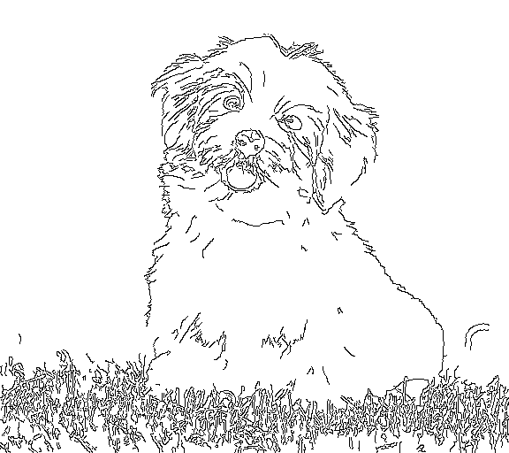

# ControlNet模型-推理指导  


- [概述](#ZH-CN_TOPIC_0000001172161501)
   
   - [输入输出数据](#section540883920406)

- [推理环境准备](#ZH-CN_TOPIC_0000001126281702)

- [快速上手](#ZH-CN_TOPIC_0000001126281700)

  - [获取源码](#section4622531142816)
  - [准备数据集](#section183221994411)
  - [模型推理](#section741711594517)

- [模型推理性能&精度](#ZH-CN_TOPIC_0000001172201573)


# 概述<a name="ZH-CN_TOPIC_0000001172161501"></a>

   ControlNet是一种神经网络结构，通过添加额外的条件来控制扩散模型，它将神经网络块的权重复制到“锁定”副本和“可训练”副本中。“可训练”的人会了解您的病情。“锁定”的模型会保留您的模型。因此，使用图像对的小数据集进行训练不会破坏生产就绪的扩散模型。“零卷积”是 1×1 卷积，权重和偏差都初始化为零。在训练之前，所有零卷积都输出零,ControlNet 不会造成任何失真。这允许在小规模甚至个人设备上进行培训。这也有利于合并/替换/偏移模型/权重/块/层。

- 参考实现：
  ```
  url=https://github.com/lllyasviel/ControlNet 
  branch=main
  commit_id=ed85cd1e25a5ed592f7d8178495b4483de0331bf
  ```

## 输入输出数据<a name="section540883920406"></a>

- 输入数据

  | 输入数据  | 大小      | 数据类型                | 数据排布格式 |
  | -------- | -------- | ------------------------- | ------------ |
  | text    |  1 x 4 x 64 x 72 | FLOAT32 |  NCHW|
  | hint    |  1 x 3 x 512 x 576 | FLOAT32 | NCHW|
  | t       |  1                | INT64 | ND|
  | cond_text| 1 x 77 x 768     | FLOAT32| ND|


- 输出数据

  | 输出数据 | 大小     | 数据类型 | 数据排布格式 |
  | -------- | -------- | -------- | ------------ |
  | text_outs | 1 x 4 x 64 x 72 | FLOAT32  | NCHW           |

# 推理环境准备<a name="ZH-CN_TOPIC_0000001126281702"></a>

- 该模型需要以下插件与驱动

  **表 1**  版本配套表
  | 配套                                                         | 版本    | 环境准备指导                                                 |
  | ------------------------------------------------------------ | ------- | ------------------------------------------------------------ |
  | 固件与驱动                                                   | 23.0.rc3  | [Pytorch框架推理环境准备](https://www.hiascend.com/document/detail/zh/ModelZoo/pytorchframework/pies) |
  | CANN                                                         | 7.0.0 | -                                                            |
  | Python                                                       | 3.8.5   | -                                                            |                                                           |


# 快速上手<a name="ZH-CN_TOPIC_0000001126281700"></a>

## 获取源码<a name="section4622531142816"></a>

1. 获取源码
   ```
   git clone https://github.com/lllyasviel/ControlNet
   mv ControlNet_pth2onnx.py ControlNet_infer.py pipeline.py modify_onnx.py ControlNet/
   ```

2. 安装依赖。
   ```
   pip3 install -r requirements.txt
   ```

3. 代码修改

   执行命令：
   
   ```
   patch -p1 < differences.patch
   ```

4. 安装昇腾统一推理工具（AIT）

   请访问[AIT代码仓](https://gitee.com/ascend/ait/tree/master/ait#ait)，根据readme文档进行工具安装。

   安装AIT时，可只安装需要的组件：benchmark，其他组件为可选安装。
   
## 准备数据集<a name="section183221994411"></a>

1. 获取原始数据集。

   本模型输入原始图片和文本生成图片，无需数据集。
   
## 模型推理<a name="section741711594517"></a>

1. 模型转换。
   使用PyTorch将模型权重文件.pth转换为.onnx文件，再使用ATC工具将.onnx文件转为离线推理模型文件.om文件。

   1. 获取权重

     
      ```
      训练权重链接为："https://huggingface.co/lllyasviel/ControlNet/blob/main/models/control_sd15_canny.pth"。
      下载后放入`ControlNet/models`工作目录下.
      ```

   2. 导出ONNX模型

      
      ```
      可提前下载openclip权重放入'ControlNet/openai/clip-vit-large-patch14'，以避免执行后面步骤时可能会出现下载失败。
      # 需要使用 git-lfs (https://git-lfs.com)
      git lfs install
      cd ControlNet
      git clone https://huggingface.co/openai/clip-vit-large-patch14
      ```

      

      执行命令：

      ```
      python3 ControlNet_pth2onnx.py --model ./models/control_sd15_canny.pth --control_path onnx/control/  --sd_path onnx/sd/
      ```

      参数说明：
      - --model：本地模型目录的路径
      - --control_path: control部分ONNX模型输出目录
      - --sd_path：sd部分onnx模型输出目录

   3. 优化ONNX模型

      运行modify_onnx.py

       ```
       python3 modify_onnx.py --model onnx/control/control.onnx  --new_model onnx/control/control_modify.onnx
       python3 modify_onnx.py --model onnx/sd/sd.onnx  --new_model onnx/sd/sd_modify.onnx
       ```
     
       FA和TOME算子需通过安装与CANN版本对应的推理引擎包来获取，FA算子为FlashAttentionTik，仅支持Pro、Duo卡形态
    
    

   
   4. 使用ATC工具将ONNX模型转OM模型。

      1. 配置环境变量。

         ```
         source /usr/local/Ascend/ascend-toolkit/set_env.sh
         source /usr/local/Ascend/aie/set_env.sh
         ```

         > **说明：** 
         >该脚本中环境变量仅供参考，请以实际安装环境配置环境变量。详细介绍请参见《[CANN 开发辅助工具指南 \(推理\)](https://support.huawei.com/enterprise/zh/ascend-computing/cann-pid-251168373?category=developer-documents&subcategory=auxiliary-development-tools)》。

      2. 执行命令查看芯片名称（$\{chip\_name\}）。

         ```
         npu-smi info
         #该设备芯片名为Ascend310P3 （自行替换）
         回显如下：
         +-------------------+-----------------+------------------------------------------------------+
         | NPU     Name      | Health          | Power(W)     Temp(C)           Hugepages-Usage(page) |
         | Chip    Device    | Bus-Id          | AICore(%)    Memory-Usage(MB)                        |
         +===================+=================+======================================================+
         | 0       310P3     | OK              | 15.8         42                0    / 0              |
         | 0       0         | 0000:82:00.0    | 0            1074 / 21534                            |
         +===================+=================+======================================================+
         | 1       310P3     | OK              | 15.4         43                0    / 0              |
         | 0       1         | 0000:89:00.0    | 0            1070 / 21534                            |
         +===================+=================+======================================================+
         ```

      3. 执行ATC命令。

         ```
         # control
         atc --framework=5 \
             --model=./onnx/control/control_modify.onnx \
             --output=./om/control/control \
             --input_format=ND \
             --log=error \
             --soc_version=Ascend${chip_name}
         
         # sd
         atc --framework=5 \
             --model=./onnx/sd/sd_modify.onnx \
             --output=./om/sd/sd \
             --input_format=ND \
             --log=error \
             --soc_version=Ascend${chip_name}

         ```
      
      参数说明：
      - --model：为ONNX模型文件。
      - --output：输出的OM模型。
      - --framework：5代表ONNX模型。
      - --log：日志级别。
      - --soc_version：处理器型号。

2. 开始推理验证。

   1. 执行推理脚本。
      ```
    
      python3 ControlNet_infer.py \
              --model ./models/control_sd15_canny.pth \
              --image test_imgs/dog.png
              --prompt "cute dog" \
              --device 0 \
              --control_model_dir om/control/control.om \
              --sd_model_dir om/sd/sd.om \
              --save_dir ./results \
              --ddim_steps 20 
   
      ```

      参数说明：
      - --model：本地模型目录的路径。
      - --prompt：文本信息。
      - --save_dir：生成图片的存放目录。
      - --ddim_steps：生成图片次数。
      - --image: 输入图片。
      - --control_model_dir: control的om位置。
      - --sd_model_dir: sd的om位置。
      - --device：推理设备ID。
      
      执行完成后在`./results`目录下生成推理图片。推理一张图片会输出一张图片边缘的图片，和一张跟据输入图片和文本重新生成的图片。

3. 推理结果图片展示。

   在线模型推理结果：

   

   

   离线模型推理结果：

   

   
   

4. 性能验证。

      可使用ais_bench推理工具的纯推理模式验证om模型的性能，参考命令如下：

        ```

        python -m ais_bench --model=${om_model_path} --loop=10 --batchsize=${batch_size} --device 0,1
        ```

      - 参数说明：
        - --model：模型路径
        - --batchsize：每批次样本数量
        - --device:Duo卡测试时设两张芯片

   
# 模型推理性能&精度<a name="ZH-CN_TOPIC_0000001172201573"></a>

调用ACL接口推理计算，性能参考下列数据。


| 硬件形态 | 性能 | 模型|
| :------: | :--------: | :--------: |
| Duo并行  | 80fps  | control |  
| Duo并行 | 33fps | sd |