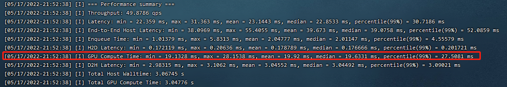
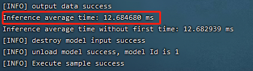

# ECAPA-TDNN模型Pytorch离线推理指导


## 1.环境准备

### 1.1 深度学习框架

```
CANN == 5.0.2
torch == 1.7.1
torchvision == 0.8.2
onnx 
```
### 1.2 python第三方库

```
tqdm
scipy
librosa
matplotlib
pydub
tensorboardX
onnx
onnxruntime
skl2onnx
```


### 1.3 onnx优化工具onnx_tool

```
git clone https://gitee.com/zheng-wengang1/onnx_tools.git
cd onnx_tools && git checkout cbb099e5f2cef3d76c7630bffe0ee8250b03d921
cd ..
```

### 1.4 获取开源模型代码

```
git clone --recursive https://github.com/Joovvhan/ECAPA-TDNN.git
mv ECAPA-TDNN ECAPA_TDNN
```

### 1.5 准备数据集
用户需自行获取VoxCeleb1数据集中测试集（无需训练集），上传数据集到服务器中,必须要与preprocess.py同目录.
其内容如下所示


### 1.6 [获取msame工具](https://gitee.com/ascend/tools/tree/master/msame)
将msame文件放到当前工作目录


## 2.模型转换

### 2.1 pytorch模型转onnx模型
加载当前工作目录下权重文件即Ecapa_Tdnn/checkpoint.pt,该权重为自己训练出的权重，后续精度以该权重下精度为标准

获取基准精度，作为精度对比参考， checkpoint.pt为权重文件相对路径， VoxCeleb为数据集相对路径， batch_size = 4

```
python get_originroc.py checkpoint.pt VoxCeleb 4
```


利用权重文件和模型的网络结构转换出所需的onnx模型， checkpoint.pt为权重文件相对路径， ecapa_tdnn.onnx 为生成的onnx模型相对路径

```
python pytorch2onnx.py checkpoint.pt ecapa_tdnn.onnx 
```

将转化出的onnx模型进行优化， ecapa_tdnn.onnx为优化前onnx模型， ecapa_tdnn_sim.onnx为优化后onnx模型

```
python fix_conv1d.py ecapa_tdnn.onnx ecapa_tdnn_sim.onnx
```

### 2.2 onnx模型转om模型，以batch_size=16为例
在710环境下，运行to_om.sh脚本，其中--model和--output参数自行修改，下面仅作参考

```
atc --framework=5 --model=ecapa_tdnn_sim.onnx --output=om/ecapa_tdnn_bs4 --input_format=ND --input_shape="mel:4,80,200" --log=debug --fusion_switch_file=fusion_switch.cfg --soc_version=Ascend710>after.log 
```

## 3.数据集预处理

在当前工作目录下，执行以下命令行,其中VoxCeleb为数据集相对路径，input/为模型所需的输入数据相对路径，speaker/为后续后处理所需标签文件的相对路径,batch_size = 4

```
python preprocess.py VoxCeleb input_bs4/ speaker_bs4/ 4
```

执行完成后将Ecapa_Tdnn/input_bs4/下内容传至710环境中

## 4.模型推理

在710环境中，cd至msame文件夹下含.masame文件的路径下

执行推理，其中--model为之前转化好的bs为4的om模型，--input为第三步中得到的前处理后的数据路径

```
./msame --model "om/ecapa_tdnn_bs4.om" --input "input_bs4/" --output "result" --outfmt TXT
```

在生成的结果只需获取其中后缀为_0的文件，将其放入一个文件夹(命名为output_bs4)后传回GPU环境下

## 5.生成推理精度

在GPU环境下，根据第四步中获取的结果output_bs4/和第三步中产生的speaker_bs4/标签文件，得到推理精度

```
 python postprocess.py output_bs4/ speaker_bs4/ 4 4648
```

## 6.精度对比
以下为测试出的batch_size=1和4的精度对比：

```
roc_auc:
          om          pth
bs1	  0.6833      0.6896
bs4	  0.6755      0.6793
```

## 7.性能对比

### 7.1 GPU性能数据
**注意：**

> 测试gpu性能要确保device空闲，使用nvidia-smi命令可查看device是否在运行其它推理任务

以bs=16为例，这里的infer_cpu.onnx为优化前onnx模型

```
trtexec --onnx=ecapa_tdnn.onnx --fp16 --shapes=mel:16x80x200
```


根据红框中信息，得到吞吐率为1000/(19.92/16)=803.21

### 7.2 NPU性能数据

以bs=16为例。利用msame进行纯推理

```
 ./msame --model "om/ecapa_tdnn_bs16.om" --output "result" --outfmt TXT --loop 100
```


根据红框中信息，得到吞吐率为1000/(12.68/16)= 1261.82

在bs=16时，模型性能达标

| Model      | batch_size | T4Throughput/Card | 710Throughput/Card | 710/T4         |
|------------|------------|-------------------|--------------------|----------------|
| ECAPA-TDNN | 1          | 485.43            | 711.23             | 1.46           |
| ECAPA-TDNN | 4          | 705.46            | 1223.24            | 1.73475177305  |
| ECAPA-TDNN | 8          | 798.4             | 1242.23            | 1.556390977444 |
| ECAPA-TDNN | 16         | 770.89            | 1263.63            | 1.64025974026  |
| ECAPA-TDNN | 32         | 828.84            | 1104.59            | 1.33333333333  |
| ECAPA-TDNN | 64         | 847.37            | 1049.008           | 1.238488783943 |
