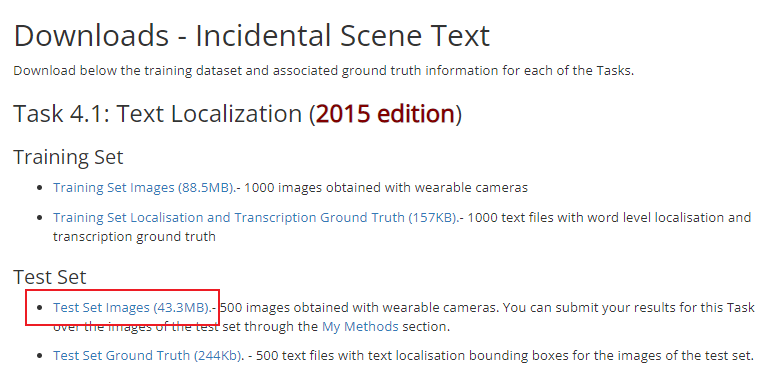

# EAST_ResNet50_vd模型-推理指导


- [概述](#ZH-CN_TOPIC_0000001172161501)

- [推理环境准备](#ZH-CN_TOPIC_0000001126281702)

- [快速上手](#ZH-CN_TOPIC_0000001126281700)

  - [获取源码](#section4622531142816)
  - [准备数据集](#section183221994411)
  - [模型推理](#section741711594517)

- [模型推理性能](#ZH-CN_TOPIC_0000001172201573)

- [配套环境](#ZH-CN_TOPIC_0000001126121892)


# 概述<a name="ZH-CN_TOPIC_0000001172161501"></a>

EAST是一个高效准确的场景文本检测器，通过两步进行文本检测：先是一个全卷积的网络直接产生一个字符或者文本行的预测（可以是旋转的矩形或者不规则四边形），然后通过NMS（Non-Maximum Suppression）算法合并最后的结果。


- 参考实现：

  ```
  url=https://github.com/PaddlePaddle/PaddleOCR.git
  branch=release/2.5
  commit_id=a40f64a70b8d290b74557a41d869c0f9ce4959d5
  model_name=EAST_ResNet50_vd
  ```

  通过Git获取对应commit\_id的代码方法如下：

  ```
  git clone {repository_url}        # 克隆仓库的代码
  cd {repository_name}              # 切换到模型的代码仓目录
  git checkout {branch/tag}         # 切换到对应分支
  git reset --hard {commit_id}      # 代码设置到对应的commit_id（可选）
  cd {code_path}                    # 切换到模型代码所在路径，若仓库下只有该模型，则无需切换
  ```


## 输入输出数据<a name="section540883920406"></a>

- 输入数据

  | 输入数据 | 数据类型 | 大小                      | 数据排布格式 |
  | -------- | -------- | ------------------------- | ------------ |
  | input    | RGB_FP32 | batchsize x 3 x 704 x 1280 | NCHW         |


- 输出数据

  | 输出数据 | 大小     | 数据类型 | 数据排布格式 |
  | -------- | -------- | -------- | ------------ |
  | output1  | batchsize x 1 x 176 x 320 | FLOAT32  | NCHW           |
  | output2  | batchsize x 8 x 176 x 320 | FLOAT32  | NCHW           |


# 推理环境准备\[所有版本\]<a name="ZH-CN_TOPIC_0000001126281702"></a>

- 该模型需要以下插件与驱动

  **表 1**  版本配套表

| 配套                                                         | 版本    | 环境准备指导                                                 |
| ------------------------------------------------------------ | ------- | ------------------------------------------------------------ |
| 固件与驱动                                                   | 22.0.2  | [Pytorch框架推理环境准备](https://www.hiascend.com/document/detail/zh/ModelZoo/pytorchframework/pies) |
| CANN                                                         | 5.1.RC2 | -                                                            |
| Python                                                       | 3.7.5   | -                                                            |
| paddlepaddle                                                 | 2.3.2   | -                                                            |
| 说明：Atlas 300I Duo 推理卡请以CANN版本选择实际固件与驱动版本。 | \       | \                                                            |

# 快速上手<a name="ZH-CN_TOPIC_0000001126281700"></a>

## 获取源码<a name="section4622531142816"></a>

1. 获取源码。

   ```
   git clone -b release/2.5 https://github.com/PaddlePaddle/PaddleOCR.git
   cd PaddleOCR 
   git reset --hard a40f64a70b8d290b74557a41d869c0f9ce4959d5
   git apply ../EAST_ResNet50_vd.patch
   cd ..
   ```

2. 安装依赖。

   ```
   pip3 install -r requirements.txt
   cd PaddleOCR
   python3 setup.py install
   cd ..
   ```

## 准备数据集<a name="section183221994411"></a>

1. 获取原始数据集。（解压命令参考tar –xvf  \*.tar与 unzip \*.zip）

   ICDAR 2015 数据集包含1000张训练图像和500张测试图像。参考[[PaddleOCR数据集](https://github.com/PaddlePaddle/PaddleOCR/blob/release/2.5/doc/doc_ch/dataset/ocr_datasets.md)]数据处理方式，ICDAR 2015 数据集可以点击[[链接](https://rrc.cvc.uab.es/?ch=4&com=downloads)]进行下载，首次下载需注册。注册完成登陆后，下载下图中红色框标出的部分。

   <p align="center">
    
   <p align="center">

   将数据集`ch4_test_images.zip`放在`EAST_ResNet50_vd`工作目录下，通过以下命令创建`train_data/icdar2015/text_localization`路径，将下载的数据集保存该路径下，并在该路径下通过以下命令进行解压保存并获取标签文件。
   ```
   mkdir -p ./train_data/icdar2015/text_localization/ch4_test_images/
   unzip -d ./train_data/icdar2015/text_localization/ch4_test_images/ ch4_test_images.zip
   wget -P ./train_data/icdar2015/text_localization/ https://paddleocr.bj.bcebos.com/dataset/test_icdar2015_label.txt
   ```

2. 数据预处理。\(请拆分sh脚本，将命令分开填写\)

   数据预处理将原始数据集转换为模型输入的数据。

   在`EAST_ResNet50_vd`工作目录下，执行EAST_ResNet50_vd_preprocess.py脚本，完成预处理。

   ```
    python3 EAST_ResNet50_vd_preprocess.py \
        --config=PaddleOCR/configs/det/det_r50_vd_east.yml \
        --opt=bin_data=./icda2015_bin
   ```

   - 参数说明：

       -   --config：模型配置文件。
       -   --opt：bin文件保存路径。

   运行后在当前目录下的`icda2015_bin`路径中保存生成的二进制数据。


## 模型推理<a name="section741711594517"></a>

1. 模型转换。

   使用`paddle2onnx`将模型权重文件转换为.onnx文件，再使用ATC工具将.onnx文件转为离线推理模型文件.om文件。

   1. 获取权重文件。

       训练权重链接为：https://paddleocr.bj.bcebos.com/dygraph_v2.0/en/det_r50_vd_east_v2.0_train.tar。
       在`EAST_ResNet50_vd`工作目录下可通过以下命令获取训练权重并转为推理模型。
       ```
       wget -nc -P ./checkpoint https://paddleocr.bj.bcebos.com/dygraph_v2.0/en/det_r50_vd_east_v2.0_train.tar
       cd ./checkpoint && tar xf det_r50_vd_east_v2.0_train.tar && cd ..
       python3 PaddleOCR/tools/export_model.py \
           -c PaddleOCR/configs/det/det_r50_vd_east.yml \
           -o Global.pretrained_model=./checkpoint/det_r50_vd_east_v2.0_train/best_accuracy \
           Global.save_inference_dir=./inference/det_r50_east
       ```
      
       - 参数说明：

            -   -c：模型配置文件。
            -   -o: 模型入参信息。
            -   Global.pretrained_model：权重文件保存路径。
            -   Global.save_inference_dir：paddleocr推理模型保存路径。

   2. 导出onnx文件。

      1. 使用paddle2onnx工具导出onnx文件。

         在`EAST_ResNet50_vd`工作目录下通过运行以下命令获取onnx模型。

         ```
         paddle2onnx \
             --model_dir ./inference/det_r50_east \
             --model_filename inference.pdmodel \
             --params_filename inference.pdiparams \
             --save_file ./EAST_ResNet50_vd.onnx \
             --opset_version 11 --enable_onnx_checker True \
             --input_shape_dict="{'x':[-1,3,704,1280]}"
         ```

         参数说明请通过`paddle2onnx -h`命令查看。
         运行后在`EAST_ResNet50_vd`目录下获得EAST_ResNet50_vd.onnx文件。

   3. 使用ATC工具将ONNX模型转OM模型。

      1. 配置环境变量。

         ```
         source /usr/local/Ascend/ascend-toolkit/set_env.sh
         ```

         > **说明：** 
         >该脚本中环境变量仅供参考，请以实际安装环境配置环境变量。详细介绍请参见《[CANN 开发辅助工具指南 \(推理\)](https://support.huawei.com/enterprise/zh/ascend-computing/cann-pid-251168373?category=developer-documents&subcategory=auxiliary-development-tools)》。

      2. 执行命令查看芯片名称（$\{chip\_name\}）。

         ```
         npu-smi info
         #该设备芯片名为Ascend310P3 （自行替换）
         回显如下：
         +-------------------+-----------------+------------------------------------------------------+
         | NPU     Name      | Health          | Power(W)     Temp(C)           Hugepages-Usage(page) |
         | Chip    Device    | Bus-Id          | AICore(%)    Memory-Usage(MB)                        |
         +===================+=================+======================================================+
         | 0       310P3     | OK              | 15.8         42                0    / 0              |
         | 0       0         | 0000:82:00.0    | 0            1074 / 21534                            |
         +===================+=================+======================================================+
         | 1       310P3     | OK              | 15.4         43                0    / 0              |
         | 0       1         | 0000:89:00.0    | 0            1070 / 21534                            |
         +===================+=================+======================================================+
         ```

      3. 执行ATC命令。
         ```
         atc --framework=5 \
             --model=./EAST_ResNet50_vd.onnx \
             --output=./EAST_ResNet50_vd_bs${batchsize} \
             --input_format=NCHW \
             --input_shape="x:${batchsize},3,704,1280" \
             --log=error \
             --soc_version=Ascend${chip_name} 
         ```

         - 参数说明：

           -   --model：为ONNX模型文件。
           -   --framework：5代表ONNX模型。
           -   --output：输出的OM模型。
           -   --input\_format：输入数据的格式。
           -   --input\_shape：输入数据的shape。
           -   --log：日志级别。
           -   --soc\_version：处理器型号。

           `${batchsize}`表示om模型可支持不同batch推理，可取值为：1，4，8，16，32，64。
           运行成功后生成`EAST_ResNet50_vd_bs${batchsize}.om`模型文件。

2. 开始推理验证。

   a.  安装ais_bench推理工具。

      请访问[ais_bench推理工具](https://gitee.com/ascend/tools/tree/master/ais-bench_workload/tool/ais_bench)代码仓，根据readme文档进行工具安装。  


   b.  执行推理。

      ```
      python3 -m ais_bench \
          --model=./EAST_ResNet50_vd_bs${batchsize}.om \
          --input=./icda2015_bin \
          --output=./
          --batchsize=${batchsize}
      ```

      -   参数说明：

           -   --model：om模型路径。
           -   --input：bin文件路径。
           -   --output：推理结果保存路径。
           -   --batchsize：om模型的batch。

      `${batchsize}`表示不同batch的om模型。

      推理完成后在当前`EAST_ResNet50_vd`工作目录生成推理结果。其目录命名格式为`xxxx_xx_xx-xx_xx_xx`(`年_月_日-时_分_秒`)，如`2022_08_18-06_55_19`。


   c.  精度验证。

      执行后处理脚本`EAST_ResNet50_vd_postprocess.py`，参考命令如下：

      ```
      python EAST_ResNet50_vd_postprocess.py \
        --config=PaddleOCR/configs/det/det_r50_vd_east.yml \
        --opt=results=${output_path}
      ```

      -   参数说明：

            -   --config：模型配置文件。
            -   --opt：推理结果路径。

      ${output_path}为推理结果的保存路径。

      推理结果通过屏显显示，如下：

      ```
      {'precision': 0.8858638743455497, 'recall': 0.8146364949446316, 'hmean': 0.8487584650112866}
      ```

   d.  性能验证。

      可使用ais_bench推理工具的纯推理模式验证不同batch_size的om模型的性能，参考命令如下：

      ```
      python3 -m ais_bench \
          --model=./EAST_ResNet50_vd_bs${batchsize}.om \
          --loop=50 \
          --batchsize=${batchsize}
      ```

      -   参数说明：

          -   --model：om模型路径。
          -   --loop：推理次数。
          -   --batchsize：om模型的batch。

      `${batchsize}`表示不同batch的om模型。

      纯推理完成后，在ais_bench的屏显日志中`throughput`为计算的模型推理性能，如下所示：

      ```
       [INFO] throughput 1000*batchsize(8)/NPU_compute_time.mean(83.54555969238281): 95.75613628607233
      ```


# 模型推理性能&精度<a name="ZH-CN_TOPIC_0000001172201573"></a>

调用ACL接口推理计算，性能参考下列数据。

| 芯片型号 | Batch Size   | 数据集 | 精度 | 性能 |
| --------- | ---------------- | ---------- | ---------- | --------------- |
|Ascend310P3| 1                | ICDAR 2015 | {'precision': 0.8858, 'recall': 0.8146, 'hmean': 0.8487} | 67.798 fps |
|Ascend310P3| 4                | ICDAR 2015 | {'precision': 0.8858, 'recall': 0.8146, 'hmean': 0.8487} | 69.242 fps |
|Ascend310P3| 8                | ICDAR 2015 | {'precision': 0.8858, 'recall': 0.8146, 'hmean': 0.8487} | 95.756 fps |
|Ascend310P3| 16               | ICDAR 2015 | {'precision': 0.8858, 'recall': 0.8146, 'hmean': 0.8487} | 62.913 fps |
|Ascend310P3| 32               | ICDAR 2015 | {'precision': 0.8858, 'recall': 0.8146, 'hmean': 0.8487} | 58.980 fps |
|Ascend310P3| 64               | ICDAR 2015 | {'precision': 0.8858, 'recall': 0.8146, 'hmean': 0.8487} | 58.329 fps |