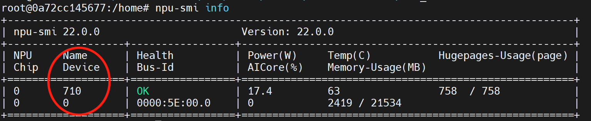

# Nasnetlarge Onnx模型端到端推理指导

-   [1 模型概述](#1-模型概述)
	-   [1.1 论文地址](#11-论文地址)
	-   [1.2 代码地址](#12-代码地址)
-   [2 环境说明](#2-环境说明)
	-   [2.1 深度学习框架](#21-深度学习框架)
	-   [2.2 python第三方库](#22-python第三方库)
-   [3 模型转换](#3-模型转换)
	-   [3.1 pth转onnx模型](#31-pth转onnx模型)
	-   [3.2 onnx转om模型](#32-onnx转om模型)
-   [4 数据集预处理](#4-数据集预处理)
	-   [4.1 数据集获取](#41-数据集获取)
	-   [4.2 数据集预处理](#42-数据集预处理)
	-   [4.3 生成数据集信息文件](#43-生成数据集信息文件)
-   [5 离线推理](#5-离线推理)
	-   [5.1 benchmark工具概述](#51-benchmark工具概述)
	-   [5.2 离线推理](#52-离线推理)
-   [6 精度对比](#6-精度对比)
	-   [6.1 离线推理精度统计](#61-离线推理精度统计)
	-   [6.2 开源精度](#62-开源精度)
	-   [6.3 精度对比](#63-精度对比)
-   [7 性能对比](#7-性能对比)
	-   [7.1 npu性能数据](#71-npu性能数据)
	-   [7.2 基准性能数据](#72-基准性能数据)
	-   [7.3 性能对比](#73-性能对比)


## 1 模型概述

-   **[论文地址](#11-论文地址)**  

-   **[代码地址](#12-代码地址)**  

### 1.1 论文地址
[论文地址](https://arxiv.org/abs/1707.07012)  

### 1.2 代码地址
[代码地址](https://github.com/Cadene/pretrained-models.pytorch#nasnet)  
branch:master    
commit id：b8134c79b34d8baf88fe0815ce6776f28f54dbfe
## 2 环境说明

-   **[深度学习框架](#21-深度学习框架)**  

-   **[python第三方库](#22-python第三方库)**  

### 2.1 深度学习框架
```
python3.7.5
CANN 5.1.RC1

pytorch >= 1.8.0
torchvision >= 0.9.0
onnx >= 1.8.0
```
### 2.2 python第三方库

```
numpy == 1.20.3
munch == 2.5.1.dev12
tqdm == 4.36.1
scipy == 1.3.1
onnx-simplifier == 0.3.5 
skl2onnx
tqdm
```

**说明：** 
>   X86架构：pytorch，torchvision和onnx可以通过官方下载whl包安装，其它可以通过pip3.7 install 包名 安装
>
>   Arm架构：pytorch，torchvision和onnx可以通过源码编译安装，其它可以通过pip3.7 install 包名 安装

## 3 模型转换

-   **[pth转onnx模型](#31-pth转onnx模型)**  

-   **[onnx转om模型](#32-onnx转om模型)**  

### 3.1 pth转onnx模型

1.下载pth权重文件  
[nasnetlarge预训练pth权重文件](http://data.lip6.fr/cadene/pretrainedmodels/nasnetalarge-a1897284.pth) 
md5sum：78a73e51ee50997294f1f35a34b4de66   
```
wget http://data.lip6.fr/cadene/pretrainedmodels/nasnetalarge-a1897284.pth
```
安装onnx_tools

```
git clone https://gitee.com/zheng-wengang1/onnx_tools.git test/onnx_tools
```

2.编写pth2onnx脚本nasnetlarge_pth2onnx.py

 **说明：**  
>目前ATC支持的onnx算子版本为11

3.执行pth2onnx脚本，生成onnx模型文件

```
python3.7 nasnetlarge_pth2onnx.py nasnetalarge-a1897284.pth nasnetlarge.onnx
```

4.使用onnxsim，生成onnx_sim模型文件

```
python3.7 -m onnxsim --input-shape="1,3,331,331" nasnetlarge.onnx nasnetlarge_sim.onnx
```

5.算子融合优化

```
python3.7 merge_sliced.py nasnetlarge_sim.onnx nasnetlarge_sim_merge.onnx
```


### 3.2 onnx转om模型

1.设置环境变量

```
source /usr/local/Ascend/ascend-toolkit/set_env.sh
```

2.使用atc将onnx模型转换为om模型文件，工具使用方法可以参考[CANN V100R020C10 开发辅助工具指南 (推理) 01](https://support.huawei.com/enterprise/zh/doc/EDOC1100164868?idPath=23710424%7C251366513%7C22892968%7C251168373)

```
atc --framework=5 --model=nasnetlarge_sim_merge.onnx --input_format=NCHW --input_shape="image:1,3,331,331" --output=nasnetlarge_sim_bs1 --log=debug --soc_version=Ascend${chip_name} 
```

注：${chip_name}由“npu-smi info”命令查看处理器获得。


## 4 数据集预处理

-   **[数据集获取](#41-数据集获取)**  
-   **[数据集预处理](#42-数据集预处理)**  
-   **[生成数据集信息文件](#43-生成数据集信息文件)**  

### 4.1 数据集获取
对于图像分类任务，该模型使用[ImageNet官网](http://www.image-net.org)的5万张验证集进行测试，图片与标签分别存放在/opt/npu/imagenet/val与/opt/npu/imagenet/val_label.txt

### 4.2 数据集预处理
1.预处理脚本preprocess_img.py

2.执行预处理脚本，生成数据集预处理后的bin文件

```
python3.7 preprocess_img.py /opt/npu/imagenet/val ./prep_dataset 
```

第一个参数为验证集路径，第二个参数为预处理后生成的二进制文件的存储路径

### 4.3 生成数据集信息文件
1.生成数据集信息文件脚本gen_dataset_info.py

2.执行生成数据集信息脚本，生成数据集信息文件

```
python3.7 gen_dataset_info.py bin ./prep_dataset ./nasnetlarge_prep_bin.info 331 331
```

第一个参数为模型输入的类型，第二个参数为生成的bin文件路径，第三个为输出的info文件，后面为宽高信息

## 5 离线推理

-   **[benchmark工具概述](#51-benchmark工具概述)**  
-   **[离线推理](#52-离线推理)**  

### 5.1 benchmark工具概述
benchmark工具为华为自研的模型推理工具，支持多种模型的离线推理，能够迅速统计出模型在Ascend310上的性能，支持真实数据和纯推理两种模式，配合后处理脚本，可以实现诸多模型的端到端过程，获取工具及使用方法可以参考[CANN V100R020C10 推理benchmark工具用户指南 01](https://support.huawei.com/enterprise/zh/doc/EDOC1100164874?idPath=23710424%7C251366513%7C22892968%7C251168373)

### 5.2 离线推理
1.设置环境变量

```
source /usr/local/Ascend/ascend-toolkit/set_env.sh
```

2.执行离线推理

```
 ./benchmark.x86_64 -model_type=vision -device_id=0 -batch_size=1 -om_path=nasnetlarge_sim_bs1.om -input_text_path=./nasnetlarge_prep_bin.info -input_width=331 -input_height=331 -output_binary=False -useDvpp=False
```

输出结果默认保存在当前目录result/dumpOutput_devicex，模型只有一个名为class的输出，shape为bs * 1000，数据类型为FP32，对应1000个分类的预测结果，每个输入对应的输出对应一个_x.bin文件。

## 6 精度对比

-   **[离线推理TopN精度](#61-离线推理TopN精度)**  
-   **[开源TopN精度](#62-开源TopN精度)**  
-   **[精度对比](#63-精度对比)**  

### 6.1 离线推理TopN精度统计

调用imagenet_acc_eval.py脚本推理结果与label比对，可以获得Accuracy Top5数据。

```
python3.7 imagenet_acc_eval.py result/dumpOutput_device0/ /opt/npu/imagenet/val_label.txt ./ result.json
```

第一个参数为benchmark输出目录，第二个为数据集配套标签，第三个是生成文件的保存目录，第四个是生成的文件名，其中存有推理的Top5精度。
对batch1和batch16的模型分别调用benchmark进行推理，并统计其Top5的精度。查看其输出结果：

```
{"title": "Overall statistical evaluation", "value": [{"key": "Number of images", "value": "50000"}, {"key": "Number of classes", "value": "1001"}, {"key": "Top1 accuracy", "value": "82.53%"}, {"key": "Top2 accuracy", "value": "91.12%"}, {"key": "Top3 accuracy", "value": "93.91%"}, {"key": "Top4 accuracy", "value": "95.2%"}, {"key": "Top5 accuracy", "value": "95.99%"}]}
```

经过对bs1与bs16的om测试，本模型batch1与batch16的精度没有差别，精度数据均如上。

### 6.2 开源TopN精度
[github开源代码仓精度](https://github.com/Cadene/pretrained-models.pytorch/blob/master/README.md)

Model               Acc@1     Acc@5
NASNet-Large		82.566	  96.086

### 6.3 精度对比
将得到的om离线模型推理TopN精度与该模型github代码仓上公布的精度对比，Top1与Top5精度均达标。  
 **精度调试：**  
>没有遇到精度不达标的问题，故不需要进行精度调试

## 7 性能对比

-   **[npu性能数据](#71-npu性能数据)**  
-   **[基准性能数据](#72-基准性能数据)**  
-   **[性能对比](#73-性能对比)**  

### 7.1 npu性能数据
benchmark工具在整个数据集上推理时会统计性能数据，存储于result/perf_vision_batchsize_bs_device_0.txt中。但是推理整个数据集较慢，如此测性能时需要确保benchmark独占device，使用npu-smi info可以查看device是否空闲。
除此之外，也可以使用benchmark纯推理功能测得性能数据，但是由于随机数不能模拟数据分布，纯推理功能测的有些模型性能数据可能不太准，benchmark纯推理功能测性能仅为快速获取大概的性能数据以便调试优化使用，可初步确认benchmark工具在整个数据集上推理时由于device也被其它推理任务使用了导致的性能不准的问题。
模型的性能以使用benchmark工具推理得到bs1与bs16的性能数据为准；对于使用benchmark工具测试的batch4，8，32，64的性能数据仅在README.md中作如下记录。  
1.benchmark工具推理获得性能数据  
使用benchmark工具的推理功能测试模型的推理性能，命令如下：

```
./benchmark.x86_64 -model_type=vision -device_id=0 -batch_size=1 -om_path=nasnetlarge_sim1_merge.om -input_text_path=./nasnetlarge_prep_bin.info -input_width=331 -input_height=331 -output_binary=False -useDvpp=False
```

benchmark工具进行推理后测得的性能数据存储于result/perf_vision_batchsize_x_device_0.txt，其中x为模型的batch_size。

batch1性能：  

```
[e2e] throughputRate: 83.5628, latency: 598352
[data read] throughputRate: 86.2813, moduleLatency: 11.59
[preprocess] throughputRate: 86.0436, moduleLatency: 11.622
[inference] throughputRate: 83.7909, Interface throughputRate: 113.609, moduleLatency: 11.51
[postprocess] throughputRate: 83.7924, moduleLatency: 11.9343
```

batch1的310P吞吐率为113.609fps

batch16性能：

```
[e2e] throughputRate: 70.9337, latency: 704884
[data read] throughputRate: 72.9184, moduleLatency: 13.714
[preprocess] throughputRate: 72.5527, moduleLatency: 13.7831
[inference] throughputRate: 71.1929, Interface throughputRate: 143.496, moduleLatency: 11.3749
[postprocess] throughputRate: 4.4509, moduleLatency: 224.674
```

batch16 310P吞吐率 ：143.496fps

batch4性能：

```
[e2e] throughputRate: 74.6563, latency: 669736
[data read] throughputRate: 76.6128, moduleLatency: 13.0526
[preprocess] throughputRate: 76.2606, moduleLatency: 13.1129
[inference] throughputRate: 74.9629, Interface throughputRate: 163.917, moduleLatency: 11.0111
[postprocess] throughputRate: 18.7421, moduleLatency: 53.3559
```

batch4 310P吞吐率：163.917fps  

batch8性能：

```
[e2e] throughputRate: 74.2414, latency: 673479
[data read] throughputRate: 75.6931, moduleLatency: 13.2112
[preprocess] throughputRate: 75.41, moduleLatency: 13.2608
[inference] throughputRate: 74.5419, Interface throughputRate: 159.078, moduleLatency: 10.8562
[postprocess] throughputRate: 9.31917, moduleLatency: 107.306
```

batch8 310P吞吐率：159.078fps  

batch32性能：

```
[e2e] throughputRate: 87.7866, latency: 569563
[data read] throughputRate: 90.4474, moduleLatency: 11.0561
[preprocess] throughputRate: 89.7505, moduleLatency: 11.142
[inference] throughputRate: 88.4308, Interface throughputRate: 134.228, moduleLatency: 10.2621
[postprocess] throughputRate: 2.76599, moduleLatency: 361.534
```

batch32 310P吞吐率：134.228fps  

batch64性能：

```
[e2e] throughputRate: 76.969, latency: 649613
[data read] throughputRate: 79.2339, moduleLatency: 12.6209
[preprocess] throughputRate: 78.8025, moduleLatency: 12.6899
[inference] throughputRate: 77.487, Interface throughputRate: 113.828, moduleLatency: 11.7346
[postprocess] throughputRate: 1.21343, moduleLatency: 824.11
```

batch64 310P吞吐率：113.828fps  

### 7.2 基准性能数据
使用onnxruntime在T4服务器测试模型基准性能数据。

### 7.3 性能对比
| Throughput | 310     | 310P    | T4     | 310P/310    | 310P/T4     |
| ---------- | ------- | ------- | ------ | ----------- | ----------- |
| bs1        | 120.712 | 122.147 | 31.746 | 1.011887799 | 3.847634348 |
| bs4        | 131.478 | 165.939 | 39.468 | 1.262104687 | 4.204393433 |
| bs8        | 123.164 | 155.383 | 38.319 | 1.261594297 | 4.054985777 |
| bs16       | 120.508 | 143.066 | 30.119 | 1.187190892 | 4.750024901 |
| bs32       | 98.14   | 136.04  | 29.357 | 1.386183004 | 4.633988487 |
| bs64       | 114.13  | 114.448 | 41.057 | 1.002786296 | 2.787539275 |
|            |         |         |        |             |             |
| 最优batch  | 131.478 | 165.939 | 41.057 | 1.262104687 | 4.041673771 |


