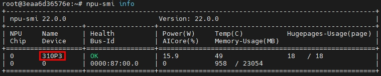

# centroids-reid ONNX模型端到端推理指导
-   [1 模型概述](#1-模型概述)
	-   [1.1 论文地址](#11-论文地址)
	-   [1.2 代码地址](#12-代码地址)
-   [2 环境说明](#2-环境说明)
	-   [2.1 深度学习框架](#21-深度学习框架)
	-   [2.2 python第三方库](#22-python第三方库)
-   [3 模型转换](#3-模型转换)
	-   [3.1 pth转onnx模型](#31-pth转onnx模型)
	-   [3.2 onnx转om模型](#32-onnx转om模型)
-   [4 数据集预处理](#4-数据集预处理)
	-   [4.1 数据集获取](#41-数据集获取)
	-   [4.2 数据集预处理](#42-数据集预处理)
-   [5 离线推理](#5-离线推理)
	-   [5.1 ais_infer工具概述](#51-ais_infer工具概述)
	-   [5.2 离线推理](#52-离线推理)
-   [6 精度对比](#6-精度对比)
	-   [6.1 开源TopN精度](#61-开源TopN精度)
	-   [6.2 推理TopN精度](#62-推理TopN精度)
	-   [6.3 精度对比](#63-精度对比)
-   [7 性能对比](#7-性能对比)
	-   [7.1 npu性能数据](#71-npu性能数据)
	-   [7.2 性能对比](#72-性能对比)


## 1 模型概述

-   **[论文地址](#11-论文地址)**  

-   **[代码地址](#12-代码地址)**  

### 1.1 论文地址
[centroids-reid论文](https://arxiv.org/pdf/2104.13643.pdf)

 

### 1.2 代码地址
centroids-reid开源仓代码：https://github.com/mikwieczorek/centroids-reid
> branch=main 
> commit_id=a1825b7a92b2a8d5e223708c7c43ab58a46efbcf

## 2 环境说明

-   **[深度学习框架](#21-深度学习框架)**  

### 2.1 深度学习框架
```
python==3.7.1
pytorch==1.7.1
pytorch-lightning==1.1.4
torchvision==0.8.2
```

### 2.2 python第三方库

```
einops
mlflow
opencv-python
tqdm
yacs
```

**说明：** 
>   X86架构：pytorch，torchvision和onnx可以通过官方下载whl包安装，其它可以通过pip3.7 install 包名 安装
>
>   Arm架构：pytorch，torchvision和onnx可以通过源码编译安装，其它可以通过pip3.7 install 包名 安装

## 3 模型转换

-   **[pth转onnx模型](#31-pth转onnx模型)**  

-   **[onnx转om模型](#32-onnx转om模型)**  

### 3.1 pth转onnx模型

1.centroids-reid模型代码下载
```
https://github.com/mikwieczorek/centroids-reid.git 
branch=main 
commit_id=a1825b7a92b2a8d5e223708c7c43ab58a46efbcf

cd ./centroids-reid
git clone https://github.com/mikwieczorek/centroids-reid.git 
patch -p1 <  centroid-reid.patch
```
2.下载pth权重文件  
下载地址[centroids-reid pth权重文件](https://pan.baidu.com/s/1qj5FNBx_H2vrv5aL7DOS_g) 提取码：oyoi 

**说明：** 
>模型文件名为：dukemtmcreid_resnet50_256_128_epoch_120.ckpt ，获取的上述的2个模型放在本仓models/目录下

3.编写pth2onnx脚本pth2onnx.py

 **说明：**  
>注意目前ATC支持的onnx算子版本为11

4.执行pth2onnx脚本，生成onnx模型文件
```
python ./pth2onnx.py  --input_file ./models/dukemtmcreid_resnet50_256_128_epoch_120.ckpt --output_file centroid-reid_r50_bs1.onnx  --batch_size 1          
```
 **说明**  
>将dukemtmcreid_resnet50_256_128_epoch_120.ckpt 模型转为centroid-reid_r50.onnx模型，注意，生成onnx模型名(第二个参数)和batch size(第三个参数)根据实际大小设置

>此模型转换为onnx需要修改开源代码仓代码


### 3.2 onnx转om模型

1.设置环境变量
```
source /usr/local/Ascend/ascend-toolkit/set_env.sh
```
2.使用atc将onnx模型转换为om模型文件，工具使用方法可以参考[CANN V100R020C10 开发辅助工具指南 (推理) 01](https://support.huawei.com/enterprise/zh/doc/EDOC1100164868?idPath=23710424%7C251366513%7C22892968%7C251168373)
```
export TUNE_BANK_PATH=${path_to_custom_tune_bank}/custom_tune_bank/bs${bs}
atc --framework=5 --model=centroid-reid_r50_bs1.onnx --output=centroid-reid_r50_bs1 input_shape="input:1,3,256,128" --input_format=NCHW --log=error --soc_version=${chip_name}
```
 **说明：**  
>其中{chip_name}可通过npu-smi info命令查看 , {path_to_custom_tune_bank}为知识库位置


## 4 数据集预处理

-   **[数据集获取](#41-数据集获取)**  

-   **[数据集预处理](#42-数据集预处理)**  


### 4.1 数据集获取
该模型使用[DukeMTMC-reID数据集](https://pan.baidu.com/s/1Oj78IrCnG_QSfhi9UY5mvA)，提取码为：eufe。


### 4.2 数据集预处理
1.预处理脚本PCB_pth_preprocess.py

2.执行预处理脚本，生成数据集预处理后的bin文件
```
python ./centroid-reid_preprocess.py  --data_root_path /opt/npu/ --src_path DukeMTMC-reID/bounding_box_test  --save_root_path /home/--save_path DukeMTMC-reID/bin_data/gallery
python ./centroid-reid_preprocess.py  --data_root_path /opt/npu/ --src_path DukeMTMC-reID/query --save_root_path /home/ --save_path DukeMTMC-reID/bin_data/query
```

## 5 离线推理

-   **[ais_infer工具概述](#51-ais_infer工具概述)**  

-   **[离线推理](#52-离线推理)**  

### 5.1 ais_infer工具概述

AisBench推理工具，该工具包含前端和后端两部分。 后端基于c+开发，实现通用推理功能； 前端基于python开发，实现用户界面功能。获取工具及使用方法可以参考https://gitee.com/ascend/tools/tree/master/ais-bench_workload/tool/ais_infer
### 5.2 离线推理
1.设置环境变量
```
source /usr/local/Ascend/ascend-toolkit/set_env.sh
```
2.执行离线推理
```
#gallery 
python ais_infer.py --model "./centroid-reid_r50_bs1.om"  --input "/DukeMTMC-reID/bin_data/gallery"  --output "/DukeMTMC-reID/result/gallery"  --outfmt TXT >> gallary_bs1.log
```
```
#query 
python ais_infer.py --model "./centroid-reid_r50_bs1.om"  --input "/DukeMTMC-reID/bin_data/query"  --output "/DukeMTMC-reID/result/query"  --outfmt TXT >> query_bs1.log
```
输出结果默认保存在当前目录/DukeMTMC-reID/result/下，由于需要通过om模型提取两组特征，因此根据输入图片类型（query或gallery）分别重命名文件夹。

3.特征图后处理
```
python ./centroid-reid_postprocess.py --dataset_dir /DukeMTMC-reID/result/ --query_path query/2022528_15_44_24_128520  --gallery_path  gallery/2022528_15_43_9_215073 >> postprocess.log
```

## 6 精度对比

-   **[开源TopN精度](#61-开源TopN精度)** 
-   **[推理TopN精度](#62-推理TopN精度)**  
-   **[精度对比](#63-精度对比)**  

### 6.1 开源TopN精度
```
CMC Scores  DukeMTMC-reID
  top-1          95.6%
  top-5          96.2%
  top-10         97.9%
mAP: 0.961
```
### 6.2 推理TopN精度
```
CMC Scores  DukeMTMC-reID
  top-1          96.8%
  top-5          98.7%
  top-10         99.1%
mAP: 0.974
```
### 6.3 精度对比
将得到的om离线模型推理TopN精度与该模型github代码仓上公布的精度对比，精度有所上升，故精度达标。  
 **精度调试：**  
>没有遇到精度不达标的问题，故不需要进行精度调试

## 7 性能对比

-   **[npu性能数据](#71-npu性能数据)**  
-   **[性能对比](#72-性能对比)** 

### 7.1 npu性能数据
AOE（Ascend Optimize Engine）是一款自动调优工具，作用是充分利用有限的硬件资源，以满足算子和整网的性能要求。AOE通过生成调优策略、编译、在运行环境上验证的闭环反馈机制，不断迭代出更优的调优策略，最终得到最佳的调优策略。从而可以更充分利用硬件资源，不断提升网络的性能，达到最优的效果。
获取工具及使用方法可以参考：https://www.hiascend.com/document/detail/zh/CANNCommunityEdition/51RC2alpha003/developmenttools/devtool/atlasdevtool_16_0012.html

ais_infer工具推理获得性能数据  
batch1的性能：
```
[INFO] -----------------Performance Summary------------------
[INFO] H2D_latency (ms): min = 0.17762184143066406, max = 0.17762184143066406, mean = 0.17762184143066406, median = 0.17762184143066406, percentile(99%) = 0.17762184143066406
[INFO] NPU_compute_time (ms): min = 0.7803440093994141, max = 0.7803440093994141, mean = 0.7803440093994141, median = 0.7803440093994141, percentile(99%) = 0.7803440093994141
[INFO] D2H_latency (ms): min = 0.0, max = 0.0, mean = 0.0, median = 0.0, percentile(99%) = 0.0
[INFO] throughput (1000*batchsize/NPU_compute_time): 1281.4860983806905
[INFO] ------------------------------------------------------
```
Interface throughputRate: 1281.48fps（batch1 310P单卡吞吐率）

batch4的性能：
```
[INFO] -----------------Performance Summary------------------
[INFO] H2D_latency (ms): min = 0.4603862762451172, max = 0.4603862762451172, mean = 0.4603862762451172, median = 0.4603862762451172, percentile(99%) = 0.4603862762451172
[INFO] NPU_compute_time (ms): min = 1.3628005981445312, max = 1.3628005981445312, mean = 1.3628005981445312, median = 1.3628005981445312, percentile(99%) = 1.3628005981445312
[INFO] D2H_latency (ms): min = 0.0, max = 0.0, mean = 0.0, median = 0.0, percentile(99%) = 0.0
[INFO] throughput (1000*batchsize/NPU_compute_time): 2935.1322603219032
[INFO] ------------------------------------------------------
```
Interface throughputRate: 2935.13fps（batch4 310P单卡吞吐率）

batch8的性能：
```
[INFO] -----------------Performance Summary------------------
[INFO] H2D_latency (ms): min = 0.7963180541992188, max = 0.7963180541992188, mean = 0.7963180541992188, median = 0.7963180541992188, percentile(99%) = 0.7963180541992188
[INFO] NPU_compute_time (ms): min = 2.2575855255126953, max = 2.2575855255126953, mean = 2.2575855255126953, median = 2.2575855255126953, percentile(99%) = 2.2575855255126953
[INFO] D2H_latency (ms): min = 0.0, max = 0.0, mean = 0.0, median = 0.0, percentile(99%) = 0.0
[INFO] throughput (1000*batchsize/NPU_compute_time): 3543.6088288098003
[INFO] ------------------------------------------------------
```
Interface throughputRate: 3543.60fps（batch8 310P单卡吞吐率 ）

batch16的性能：
```
[INFO] -----------------Performance Summary------------------
[INFO] H2D_latency (ms): min = 1.5442371368408203, max = 1.5442371368408203, mean = 1.5442371368408203, median = 1.5442371368408203, percentile(99%) = 1.5442371368408203
[INFO] NPU_compute_time (ms): min = 4.057407379150391, max = 4.057407379150391, mean = 4.057407379150391, median = 4.057407379150391, percentile(99%) = 4.057407379150391
[INFO] D2H_latency (ms): min = 0.0, max = 0.0, mean = 0.0, median = 0.0, percentile(99%) = 0.0
[INFO] throughput (1000*batchsize/NPU_compute_time): 3943.4048654365965
[INFO] ------------------------------------------------------
```
Interface throughputRate:3943.40fps（batch16 310P单卡吞吐率）  

batch32的性能：
```
[INFO] -----------------Performance Summary------------------
[INFO] H2D_latency (ms): min = 2.3374557495117188, max = 2.3374557495117188, mean = 2.3374557495117188, median = 2.3374557495117188, percentile(99%) = 2.3374557495117188
[INFO] NPU_compute_time (ms): min = 10.14852523803711, max = 10.14852523803711, mean = 10.14852523803711, median = 10.14852523803711, percentile(99%) = 10.14852523803711
[INFO] D2H_latency (ms): min = 0.0, max = 0.0, mean = 0.0, median = 0.0, percentile(99%) = 0.0
[INFO] throughput (1000*batchsize/NPU_compute_time): 3153.167504581121
[INFO] ------------------------------------------------------
```
Interface throughputRate:3153.16fps（batch32 310P单卡吞吐率）


### 7.2 性能对比

npu在bs为8时性能最佳，gpu在bs为32时性能最佳，两者对比：
``` 
Ascend 310P/gpu=3943.40/2331.34=1.69倍
```
性能达标 