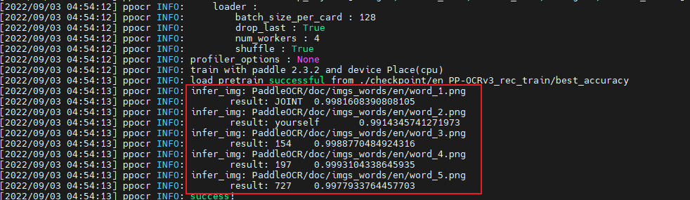

# en_PP-OCRv3_rec模型-推理指导


- [概述](#ZH-CN_TOPIC_0000001172161501)

- [推理环境准备](#ZH-CN_TOPIC_0000001126281702)

- [快速上手](#ZH-CN_TOPIC_0000001126281700)

  - [获取源码](#section4622531142816)
  - [准备数据集](#section183221994411)
  - [模型推理](#section741711594517)

- [模型推理性能](#ZH-CN_TOPIC_0000001172201573)

- [配套环境](#ZH-CN_TOPIC_0000001126121892)


# 概述<a name="ZH-CN_TOPIC_0000001172161501"></a>

en_PP-OCRv3_rec是基于[[PP-OCRv3](https://github.com/PaddlePaddle/PaddleOCR/blob/release/2.5/doc/doc_ch/PP-OCRv3_introduction.md)]的英文识别模型，PP-OCRv3的识别模块是基于文本识别算法SVTR优化。SVTR不再采用RNN结构，通过引入Transformers结构更加有效地挖掘文本行图像的上下文信息，从而提升文本识别能力。

- 参考实现：

  ```
  url=https://github.com/PaddlePaddle/PaddleOCR.git
  branch=release/2.5
  commit_id=a40f64a70b8d290b74557a41d869c0f9ce4959d5
  model_name=en_PP-OCRv3_rec
  ```

  通过Git获取对应commit\_id的代码方法如下：

  ```
  git clone {repository_url}        # 克隆仓库的代码
  cd {repository_name}              # 切换到模型的代码仓目录
  git checkout {branch/tag}         # 切换到对应分支
  git reset --hard {commit_id}      # 代码设置到对应的commit_id（可选）
  cd {code_path}                    # 切换到模型代码所在路径，若仓库下只有该模型，则无需切换
  ```


## 输入输出数据<a name="section540883920406"></a>

- 输入数据

  | 输入数据 | 数据类型 | 大小                      | 数据排布格式 |
  | -------- | -------- | ------------------------- | ------------ |
  | input    | RGB_FP32 | batchsize x 3 x 48 x 320 | NCHW         |

- 输出数据

  | 输出数据 | 大小     | 数据类型 | 数据排布格式 |
  | -------- | -------- | -------- | ------------ |
  | output1  | batchsize x 40 x 97 | FLOAT32  | ND           |


# 推理环境准备\[所有版本\]<a name="ZH-CN_TOPIC_0000001126281702"></a>

- 该模型需要以下插件与驱动

  **表 1**  版本配套表

| 配套                                                         | 版本    | 环境准备指导                                                 |
| ------------------------------------------------------------ | ------- | ------------------------------------------------------------ |
| 固件与驱动                                                   | 22.0.2  | [Pytorch框架推理环境准备](https://www.hiascend.com/document/detail/zh/ModelZoo/pytorchframework/pies) |
| CANN                                                         | 5.1.RC2 | -                                                            |
| Python                                                       | 3.7.5   | -                                                            |
| paddlepaddle                                                 | 2.3.2   | -                                                            |
| 说明：Atlas 300I Duo 推理卡请以CANN版本选择实际固件与驱动版本。 | \       | \                                                            |

# 快速上手<a name="ZH-CN_TOPIC_0000001126281700"></a>

## 获取源码<a name="section4622531142816"></a>

1. 获取源码。

   ```
   git clone -b release/2.5 https://github.com/PaddlePaddle/PaddleOCR.git
   cd PaddleOCR 
   git reset --hard a40f64a70b8d290b74557a41d869c0f9ce4959d5
   git apply ../en_PP-OCRv3_rec.patch
   cd ..
   ```

2. 安装依赖。

   ```
   pip3 install -r requirements.txt
   cd PaddleOCR
   python3 setup.py install
   cd ..
   ```

## 准备数据集<a name="section183221994411"></a>

1. 获取原始数据集。（解压命令参考tar –xvf  \*.tar与 unzip \*.zip）

   该模型使用PaddleOCR提供的英文识别[样例图片](https://github.com/PaddlePaddle/PaddleOCR/tree/release/2.6/doc/imgs_words/en)作为测试集，该样本图片在`en_PP-OCRv3_rec/PaddleOCR/doc/imgs_words/en/`目录下，包括5张图片样本，在线推理方式参考[文字识别模型评估与预测](https://github.com/PaddlePaddle/PaddleOCR/blob/release/2.6/doc/doc_ch/recognition.md#32-%E6%B5%8B%E8%AF%95%E8%AF%86%E5%88%AB%E6%95%88%E6%9E%9C)，测试结果如下：

   <p align="center">
    
   <p align="center">

2. 数据预处理。\(请拆分sh脚本，将命令分开填写\)

   数据预处理将原始数据集转换为模型输入的数据。

   在`en_PP-OCRv3_rec`工作目录下，执行en_PP-OCRv3_rec_preprocess.py脚本，完成预处理。

   ```
    python3 en_PP-OCRv3_rec_preprocess.py \
        -c PaddleOCR/configs/rec/PP-OCRv3/en_PP-OCRv3_rec.yml \
        -o Global.infer_img=PaddleOCR/doc/imgs_words/en/ Global.bin_data=./image_bin

   ```

   - 参数说明：

       -   -c：模型配置文件。
       -   -o：可选参数列表: Global.infer_img表示图片路径，Global.bin_data表示bin文件保存路径。

   运行后在当前目录下的`image_bin`路径中保存生成的二进制数据。


## 模型推理<a name="section741711594517"></a>

1. 模型转换。

   使用`paddle2onnx`将模型权重文件转换为.onnx文件，再使用ATC工具将.onnx文件转为离线推理模型文件.om文件。

   1. 获取权重文件。

       推理模型链接为：https://paddleocr.bj.bcebos.com/PP-OCRv3/english/en_PP-OCRv3_rec_infer.tar。
       在`en_PP-OCRv3_rec`工作目录下可通过以下命令获取训练权重并转为推理模型。
       ```
       wget -nc -P ./inference https://paddleocr.bj.bcebos.com/PP-OCRv3/english/en_PP-OCRv3_rec_infer.tar
       cd ./inference && tar xf en_PP-OCRv3_rec_infer.tar && cd ..
       ```

   2. 导出onnx文件。

      1. 使用paddle2onnx工具导出onnx文件。

         在`en_PP-OCRv3_rec`工作目录下通过运行以下命令获取onnx模型。

         ```
         paddle2onnx \
             --model_dir ./inference/en_PP-OCRv3_rec_infer \
             --model_filename inference.pdmodel \
             --params_filename inference.pdiparams \
             --save_file ./en_PP-OCRv3_rec.onnx \
             --opset_version 11 \
             --enable_onnx_checker True \
             --input_shape_dict="{'x':[-1,3,48,320]}"
         ```

         参数说明请通过`paddle2onnx -h`命令查看。
         运行后在`en_PP-OCRv3_rec`目录下获得en_PP-OCRv3_rec.onnx文件。

   3. 使用ATC工具将ONNX模型转OM模型。

      1. 配置环境变量。

         ```
         source /usr/local/Ascend/ascend-toolkit/set_env.sh
         ```

         > **说明：** 
         >该脚本中环境变量仅供参考，请以实际安装环境配置环境变量。详细介绍请参见《[CANN 开发辅助工具指南 \(推理\)](https://support.huawei.com/enterprise/zh/ascend-computing/cann-pid-251168373?category=developer-documents&subcategory=auxiliary-development-tools)》。

      2. 执行命令查看芯片名称（$\{chip\_name\}）。

         ```
         npu-smi info
         #该设备芯片名为Ascend310P3 （自行替换）
         回显如下：
         +-------------------+-----------------+------------------------------------------------------+
         | NPU     Name      | Health          | Power(W)     Temp(C)           Hugepages-Usage(page) |
         | Chip    Device    | Bus-Id          | AICore(%)    Memory-Usage(MB)                        |
         +===================+=================+======================================================+
         | 0       310P3     | OK              | 15.8         42                0    / 0              |
         | 0       0         | 0000:82:00.0    | 0            1074 / 21534                            |
         +===================+=================+======================================================+
         | 1       310P3     | OK              | 15.4         43                0    / 0              |
         | 0       1         | 0000:89:00.0    | 0            1070 / 21534                            |
         +===================+=================+======================================================+
         ```

      3. 执行ATC命令。
         ```
         atc --framework=5 \
             --model=./en_PP-OCRv3_rec.onnx \
             --output=./en_PP-OCRv3_rec_bs${batchsize} \
             --input_format=NCHW \
             --input_shape="x:${batchsize},3,48,320" \
             --log=error \
             --soc_version=Ascend${chip_name}
         ```

         - 参数说明：

           -   --model：为ONNX模型文件。
           -   --framework：5代表ONNX模型。
           -   --output：输出的OM模型。
           -   --input\_format：输入数据的格式。
           -   --input\_shape：输入数据的shape。
           -   --log：日志级别。
           -   --soc\_version：处理器型号。

           `${batchsize}`表示om模型可支持不同batch推理，可取值为：1，4，8，16，32，64。
           运行成功后生成`en_PP-OCRv3_rec_bs${batchsize}.om`模型文件。

2. 开始推理验证。

   a.  使用ais_bench工具进行推理。

      ais_bench工具获取及使用方式请点击查看[[ais_bench 推理工具使用文档](https://gitee.com/ascend/tools/tree/master/ais-bench_workload/tool/ais_infer)]


   b.  执行推理。

      ```
      python3 -m ais_bench \
          --model=./en_PP-OCRv3_rec_bs${batchsize}.om \
          --input=./image_bin \
          --output=./
      ```

      -   参数说明：

           -   --model：om模型路径。
           -   --input：bin文件路径。
           -   --output：推理结果保存路径。

      `${batchsize}`表示不同batch的om模型。

      推理完成后在当前`en_PP-OCRv3_rec`工作目录生成推理结果。其目录命名格式为`xxxx_xx_xx-xx_xx_xx`(`年_月_日-时_分_秒`)，如`2022_08_18-06_55_19`。

      >**说明：** 
      >执行ais_bench工具请选择与运行环境架构相同的命令。参数详情请参见。

   c.  精度验证。

      执行后处理脚本`en_PP-OCRv3_rec_postprocess.py`，参考命令如下：

      ```
      python3 en_PP-OCRv3_rec_postprocess.py \
          -c PaddleOCR/configs/rec/PP-OCRv3/en_PP-OCRv3_rec.yml \
          -o Global.infer_results=${output_path}
      ```

      -   参数说明：

            -   -c：模型配置文件。
            -   -o：可选参数：Global.infer_results表示om推理结果路径。

      ${output_path}为推理结果的保存路径。

      推理结果通过终端显示，如下：

      ```
      Infer Results:  {'word_1.png': ('JOINT', 0.998046875), 'word_2.png': ('yourself', 0.990966796875), 'word_3.png': ('154', 0.998046875), 'word_4.png': ('197', 0.998046875), 'word_5.png': ('727', 0.998046875)}
      ```

   d.  性能验证。

      可使用ais_bench推理工具的纯推理模式验证不同batch_size的om模型的性能，参考命令如下：

      ```
      python3 -m ais_bench \
          --model=./en_PP-OCRv3_rec_bs${batchsize}.om \
          --loop=50 \
          --batchsize=${batchsize}
      ```

      -   参数说明：

          -   --model：om模型路径。
          -   --loop：推理次数。
          -   --batchsize：om模型的batch。

      `${batchsize}`表示不同batch的om模型。

      纯推理完成后，在ais_bench的屏显日志中`throughput`为计算的模型推理性能，如下所示：

      ```
       [INFO] throughput 1000*batchsize(16)/NPU_compute_time.mean(2.6040399980545046): 6144.298863286933
      ```


# 模型推理性能&精度<a name="ZH-CN_TOPIC_0000001172201573"></a>

调用ACL接口推理计算，性能参考下列数据。

| 芯片型号   | Batch Size   | 数据集 | 精度 | 性能 |
| --------- | ------------ | ---------- | ---------- | --------------- |
|Ascend310P3| 1            | 样例图片 | 与在线推理结果一致 | 1688.846 fps |
|Ascend310P3| 4            | 样例图片 | 与在线推理结果一致 | 4309.880 fps |
|Ascend310P3| 8            | 样例图片 | 与在线推理结果一致 | 5444.547 fps |
|Ascend310P3| 16           | 样例图片 | 与在线推理结果一致 | 6144.298 fps |
|Ascend310P3| 32           | 样例图片 | 与在线推理结果一致 | 5306.376 fps |
|Ascend310P3| 64           | 样例图片 | 与在线推理结果一致 | 5177.331 fps |