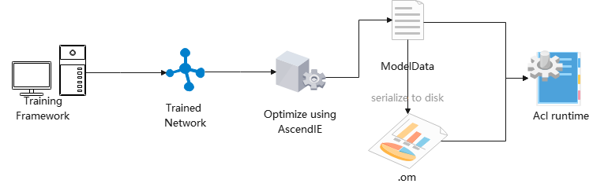
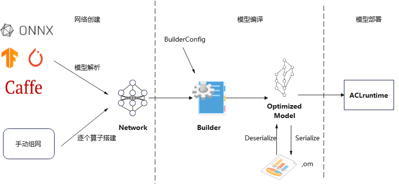
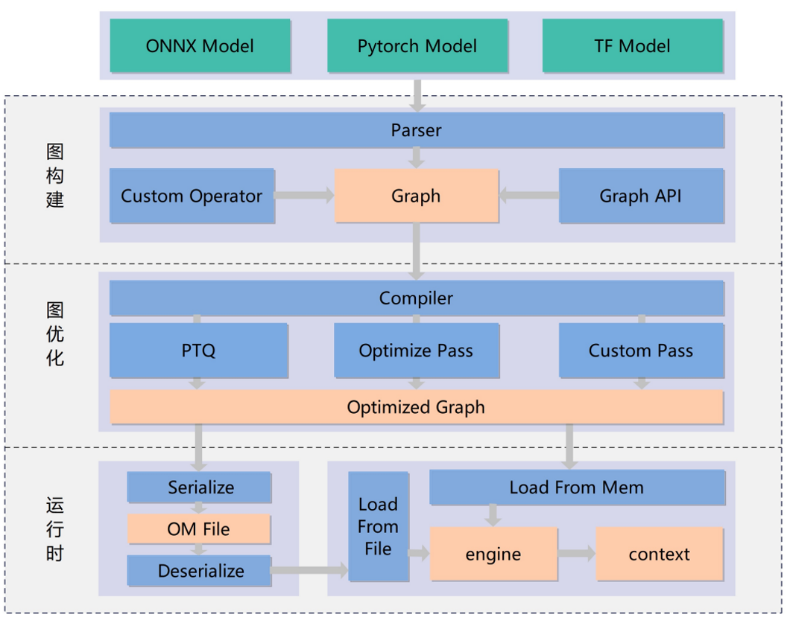
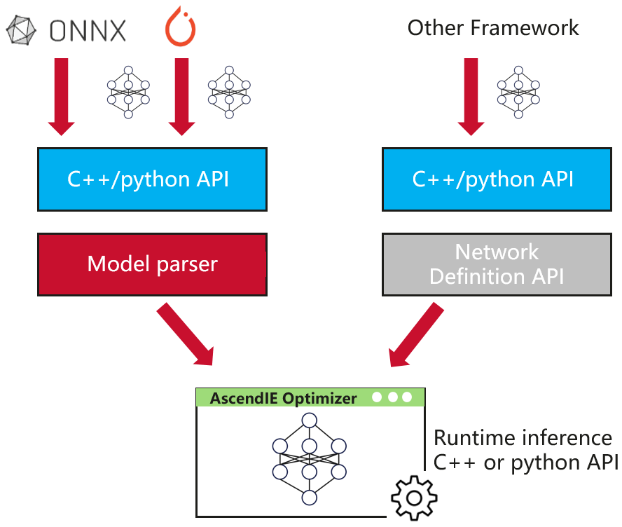

# 欢迎使用昇腾推理引擎 AscendIE
昇腾推理引擎旨在提升AI模型迁移和应用开发的效率，并提升AI推理应用的性能。本部分内容包括推理引擎和框架推理插件。

该目录提供了基于昇腾推理引擎开展应用开发的参考样例，介绍主流的网络模型的迁移、推理的端到端流程，更多模型持续更新中。如果您有任何问题和需求，请在modelzoo/issues提交issue，我们会及时处理。


# 推理引擎
提供C++/Python统一接口，实现onnx模型解析、构图等能力，快速实现onnx模型向om模型的迁移。AscendIE是针对昇腾npu设备的推理加速引擎，提供AI模型推理的商业化部署能力，能够将不同的深度学习框架（PyTorch、ONNX等）上完成训练的算法模型统一为计算图表示，具备多粒度模型优化、整图下发以及推理部署等功能。一个典型的采用AscendIE推理引擎所完成模型推理加速流程如下图1所示。


<center>图1 AscendIE推理加速流程</center>

## 快速入门
在本快速入门中，您将通过一个resnet50的图片分类应用来了解从创建网络到模型优化再到输出优化后模型的完整AscendIE调用过程，并在此过程了解涉及到的基本概念。编写一个优化模型的总体步骤如下图2所示，一般分为三步。分别为创建网络、生成模型、模型推理。


<center>图2 AscendIE开发向导</center>

**创建网络**

当用户获得了一个已经训练好的网络模型后，需要将该模型转换成AscendIE中的Network，network可以由两种方式创建获得。
* 使用parser解析框架模型文件，转换成network
* 使用network提供的layer添加接口，逐个算子搭建network
  

本快速入门示例中以使用parser解析为例，详情请查看[创建网络](#创建网络)，关键代码如下
```c++
Builder* builder = Builder::CreateInferBuilder("Ascend310P3"); // 构造onnx解析器
auto network = builder->CreateNetwork();  // 创建network
std::string modelPath("./resnet50.onnx");
OnnxModelParser parser;   
bool ret = parser.Parse(network, modelPath.c_str()); // 解析onnx model生成network
```

**生成模型**

使用builder生成模型，从network中生成出可以在昇腾芯片上部署的模型对象ModelData,可以选择是否将模型序列化并落盘。在builder过程中会对原始训练好的模型进行多级别的编译优化，然后生成昇腾芯片可以执行的代码，最终存储到ModelData中，在config选项中可以配置多个编译选项，来进行定制化编译。详情请查看[生成模型](#生成模型)
```c++
BuilderConfig config;
Modeldata modelData = builder->BuildModel(network, config);  // 生成模型
std::ofstream fout("./resnet50.om", std::ios::binary);  // 保存模型为om格式
fout.write((char*)modelData.data.get(), modelData.size);
fout.close();
```
**部署模型**

目前部署模型runtime功能暂未开放，用户可通过调用acl推理接口对编译优化后的模型进行部署推理。

**notes:** 以上快速入门完整代码已汇总到项目路径```AscendIE/cv-examples/resnet50-onnxparser```以便查阅。

## 安装和部署
### 对安装环境的要求
1.硬件要求：昇腾AI设备：Atlas300i pro
2.操作系统要求：ubuntu18.04.1
3.ubuntu系统环境软件配置：
分别使用如下命令，检查是否已安装GCC、Make、CMake等依赖软件。
```bash
gcc --version
make --version
cmake --version
python3.9 --version
```
若分别返回如下信息，说明相应软件已安装（以下回显仅为示例，请以实际情况为准）。
```
gcc (Ubuntu 7.3.0-3ubuntu1~18.04) 7.3.0
GNU Make 4.1
cmake version 3.10.2
Python 3.9.x
```
若存在未安装的依赖，请执行如下安装命令（若仅部分软件未安装，则如下命令修改为未安装的软件即可）。
```sudo apt-get install -y gcc make cmake python3.9-dev```

### 安装依赖
AscendIE通过二进制动态共享库提供，其依赖组件为driver驱动包、firmware固件包、CANN开发套件包（如表1），使用AscendIE前请提前安装这些依赖库。CANN组件包的安装方法参考《CANN软件安装指南CANN 6.3.RC2 软件安装指南》。

<center>表1 安装包清单</center>
<table>
	<tr>
		<td>简称</td>
		<td>安装包全名</td>
        <td>默认安装路径</td>
	</tr>
	<tr>
		<td>driver驱动包</td>
		<td>昇腾310 AI处理器硬件型号对应驱动软件包。
        <li>Ascend310-hdk-npu-driver_{version}_{os}_aarch64.run</li>
        <li>Ascend310-hdk-npu-driver_{version}_{os}_x86_64.run</li>
        昇腾310P AI处理器硬件型号对应驱动软件包。
        <li>Ascend310P-hdk-npu-driver_{version}_{os}-aarch64.run</li>
        <li>Ascend310P-hdk-npu-driver_{version}_{os}-x86_64.run</li>
        </td>
        <td>/usr/local/Ascend</td>
	</tr>
	<tr>
		<td>firmware固件包</td>
        <td>
        昇腾310 AI处理器硬件型号对应驱动软件包。
        <li>A300-3000/3010-npu-firmware_{version}.run</li>
        昇腾310P AI处理器硬件型号对应固件软件包。
        <li>Ascend310P-hdk-npu-firmware_{version}.run</li>
        </td>
        <td>/usr/local/Ascend</td>
	</tr>
    <tr>
        <td>CANN开发套件包</td>
        <td>Ascend-cann-toolkit_{version}_linux-{arch}.run</td>
        <td>/usr/local/Ascend/ascend-toolkit/latest</td>
    </tr>
</table>


### 安装推理引擎AscendIE包
* 步骤1：
（1）安装之前确保已经完成上一步中的安装CANN依赖。
（2）确保已经执行以下命令，使得环境变量生效,确保cann包的属主和当前属主一致，否则会安装失败。
&emsp;\# 若以root用户安装toolkit包
&emsp; ```/usr/local/Ascend/ascend-toolkit/set_env.sh```
&emsp;\# 若以非root用户安装toolkit包
&emsp; ```$HOME/Ascend/ascend-toolkit/set_env.sh```
（3）将软件包上传到安装环境的任意路径下（如：“/home/package”）并进入软件包所在路径。
* 步骤2：
增加对软件包的可执行权限。
```chmod +x Ascend-cann-aie_{version}_linux-{arch}.run```

* 步骤3：
安装软件包。
```./Ascend-cann-aie_{version}_linux-{arch} --install```
（默认生成Ascend-cann-aie文件夹，然后安装到该文件夹）或者

```./Ascend-cann-aie_{version}_linux-{arch} --install-path=your_path```

（安装到your_path/aie文件夹下）

### 卸载
卸载脚本安装在~/Ascend-cann-aie/scripts/uninstall.sh, 运行``` bash uninstall.sh```


## AscendIE工作原理
### AscendIE总体架构
AscendIE在总体架构上分为三层，分别是图构建、图优化、运行时。多种主流框架上完成训练的模型，可直接导入作为推理部署的基础，整体架构如下图3所示


<center>图3 AscendIE架构图</center>

#### 图构建
* 图构建部分核心任务为计算图graph的生成，可以通过针对不同框架的parser导入或手动构建
* 提供自定义算子注册入口
  
#### 图优化
* 图优化部分核心任务为对计算图的多层次编译优化，提高推理性能
* 提供自定义pass注册入口

#### 运行时
运行时提供了运行模型对象的接口以及运行环境。主要支持了以下功能：
* 能够脱离builder编译引擎独立部署
* 支持模型推理结果的内存复用
* 支持多任务队列的发射，并发执行

### AscendIE编程模型
简化而言，AscendIE主要分为两阶段工作，分别是build phase以及runtime phase。在第一阶段用户需要在AscendIE中构建网络，无论是通过手动组网或是利用各框架的解析器，AscendIE将会在内部将模型优化到Ascend芯片上。在第二阶段，是部署优化后的模型并执行推理。下面分阶段解释具体过程细节。
#### Build Phase

AscendIE使用Builder接口进行模型编译，最终输出编译优化后的模型，通过该模型可构建Engine进行推理。

模型生成步骤参考如下：

- 通过Builder::CreateInferBuilder创建模型编译器，创建模型编译器时需要配置设备类型（可以通过npu-smi查看当前设备类型）。
- 通过Builder::CreateNetwork创建用户模型，并构建模型结构。
- 创建BuilderConfig类，如果需要配置编译选项，使用类成员方法完成编译选项配置。
- 运行Builder::BuildModel接口，编译network，生成可运行模型。


build阶段示意如下图4所示


<center>图4 build phase过程</center>

Network为模型结构定义接口。Network有两种生成方式。

**手动组网** ：使用AscendIE的Layer接口与Tensor接口逐层进行模型结构构建。

**解析框架模型** ：一种是使用AscendIE的OnnxParser接口直接解析onnx模型自动构建。

BuilderConfig为编译配置选项接口。通过该接口，可以进行模型编译过程中的优化类型，模型动态类型，以及模型精度类型选择等配置。

在构建好Network与BuilderConfig之后，调用Builder进行模型编译。模型编译过程中会对模型进行常量折叠、CSE、LayoutTransformer等优化，并配置模型计算精度为速度更快的float16或精度更高的float32或进行int8量化压缩。

Builder将Network编译成模型内存，可以通过Engine接口直接加载，或直接保存到本地内存方便后续使用。

**注意**：

- 在一个进程中，目前只能创建一个Builder进行模型编译，支持多个Builder编译的功能正在开发当中。
- Builder不可重复的创建、释放，在Builder第一次释放时，后续编译功能将无法执行。
- Network定义时不会进行内存的深拷贝，因此在模型编译执行结束前，请不要提前释放该部分内存。


#### Runtime Phase
runtime功能AscendIE当前暂不开放，用户在获得了modelData或序列化成Om模型可以调用acl的推理接口进行部署推理。

## C++编程模型
以C++API为例，分析是如何一步一步按照编程模型完整模型编译优化的。
### 创建网络 
**Step1:创建一个Builder工具类**
调用下面接口，创建一个Builder：
```C++
Builder *builder = Builder::CreateInferBuilder("Ascend310P3"); // Ascend310P3为NPU类型，根据服务器设备类型配置
```
**Step2:使用Builder创建一个空的Network**
```C++
Network *network = builder->CreateNetwork();
```
**Step3:向Network中添加输入**
```C++
Dims inputShape({16, 3, 224, 224});
Tensor *inputTensor = network->AddInput("input1", DataType::FLOAT, inputShape);
```
**Step4:向Network中添加卷积层ConvolutionLayer**
调用Network内置API，添加ConvolutionLayer：
```C++
int32_t numOutputMap = 64;
Dims kernelHW({7, 7});
std::vector<float> weight_data(64 * 3 * 7 * 7);
std::vector<float> bias_data(64);
WeightsBuf weightBuf {DataType::FLOAT, weight_data.data(), weight_data.size()};
WeightsBuf biasBuf {DataType::FLOAT, bias_data.data(), bias_data.size()};
ConvolutionLayer *convLayer = network->AddConvolutionLayer(inputTensor, numOutputMap, kernelHW, weightBuf, biasBuf);
Dims strides({ 1, 1 });
Dims paddings({2, 2});
convLayer->SetStrides(strides);
convLayer->SetPaddings(paddings);
```
**step6:向Network中添加激活层ActivationLayer(ReLU类型)**
```C++
ActivationLayer *reluLayer = network->AddActivationLayer(convLayer->GetOutput(0), ActivationKind::RELU);
```
**step7:指定Network的输出Tensor**
```C++
network->SetAsOutput(reluLayer->GetOutput(0));
```
### 生成模型

**step1:创建BuilderConfig配置模型生成选项**

通过配置BuilderConfig中的模型选项，可以配置模型编译的调优功能、动态功能等。目前的配置方式如下：

``` C++
BuilderConfig config;
config.SetFlag(BuilderFlag::FP16);  // 设置fp16模式
```

BuilderConfig提供了多种配置选项，可以参照C++接口部分说明。

**step2:用Builder生成模型**

```C++
ModelData modelData = builder->BuildModel(network, config);
```

**Note**:

ModelData用来存储Builer生成的模型，模型数据储存在host端，可以直接保存到内存中。

**step3: 模型保存为离线文件（可选）**

```c++
std::ofstream fout(omModelName, std::ios::binary);
fout.write((char*)modelData.data.get(), modelData.size);
fout.close();
```

- omModelName为保存的离线模型文件名称

**step4: 销毁资源**

```c++
delete network;
delete builder;
```

### 部署模型
runtime功能AscendIE当前暂不开放，用户在获得了modelData或序列化成Om模型可以调用acl的推理接口进行部署推理

## python编程模型
以pythonAPI为例，逐步解释如何完成模型编译优化。
### 创建网络
与C++接口流程相似，python在创建网络时也是由创建builder->使用builder创建network->创建onnxparser->模型解析成network这几个步骤
```python
builder = aie.Builder.create_builder(b'Ascend310P3')
print("finish create builder")
network = builder.create_network()
print("finish create network")
model_path = './resnet50.onnx'
parser = aie.OnnxModelParser()
if not parser.parse(network, model_path):
    print("parse false")
    return
print("finish parse network")
```
### 生成模型
与C++生成模型过程相似，python生成模型时需要创建builderConfig，配置builderConfig类设置编译选项，并调用builder的build_model接口完成对模型的生成，并可以选择是否序列化生成的模型。
```python
builder_config = aie.BuilderConfig()
data = builder.build_model(network, builder_config)
print("finish build model")
if not data:
    print("build model failed")
with open('resnet50.om', 'wb') as f:
    f.write(data.data)
del builder
```
### 部署模型
请参考acl部署模型方法

## 日志及错误处理
### 日志处理

日志配置文件路径:```/usr/local/Ascend/aie/latest/conf/aie.conf```
<center>表2  日志配置文件选项清单</center>

| 名称 | 含义 | 选项 |
| --- | -----|-----|
| logLevel | 日志打印级别 | info, error, debug, warn |
| logScreenLevel | 日志打屏级别 | info, error, debug, warn |
| maxHistory | 日志保存时间 | 以天为单位 |
| totalSizeCap | 总日志文件大小限制 | kb为单位 |
| maxFileSize | 单个日志文件大小限制 |  kb为单位 |

```bash
// AscendIE.conf配置示例
logLevel=info
logScreenLevel=warn
maxHistory=7
totalSizeCap=102400
maxFileSize=20480
```
**查看日志**
用户可在```~/ascend/log/aielog/```目录下查看执行日志

**修改日志级别**
配置文件路径：```/usr/local/Ascend/aie/latest/conf/aie.conf``` 修改选项见表2。分别有四个级别可选：info, error, debug, warn.

**修改打屏日志级别**

配置文件路径：```/usr/local/Ascend/aie/latest/conf/aie.conf``` 修改选项见表2。分别有四个级别可选：info, error, debug, warn.

### 错误处理

在网络构建及模型编译阶段可以采用统一的错误处理方式，调用GetErrorsNum()获取异常数量，调用GetErrorByIndex(size_t index)获取具体错误描述。而在模型部署阶段，不同的接口有不同的错误返回及提示方式。

注意：对于整个AscendIE而言都不会对外抛出任何异常。
## 从TensorRT迁移到AscendIE
AscendIE 和 TensorRT的产品定位都是推理引擎，能够使用 TensorRT的所有场景，都可以替换成使用 AscendIE，包括但不限于：
* 独立使用tensorRT部署推理业务。比如使用parser解析框架模型并运行
* 将tensorRT作为一个后端，集成到框架中。
AscendIE与TensorRT有着较为相似的接口形式和相互对照的核心概念，并在编程模型和工作流程上相似，可以做到低成本的快速迁移。本小节从核心概念对照、核心代码迁移、基础特性迁移几个角度进行了介绍，帮助 TensorRT用户能快速切换到 AscendIE 上。
### 核心概念对照
<center>表2 核心概念对照</center>

| 核心概念 | TensorRT| AscendIE |
| --- | -----| ----- |
|网络|INetWorkDefinition| Network|
|算子基类|ILayer|Layer|
|张量|ITensor|Tensor|
|网络优化器和模型生成器|IBuilder|Builder|
|Builder的行为配置|IBuilderConfig|BuilderConfig|
|引擎|ICudaEngine|Engine|
|引擎的执行上下文|IExecutionContext|Context|
### 核心代码移植指南
在部署推理任务的流程上，AscendIE 和 TensorRT非常相似，都需要经过以下几个步骤.
* 模型解析：将框架训练好的模型转换成TensorRT/AscendIE模型。
* 模型编译：对TensorRT/AscendIE模型进行编译优化，生成离线可部署模型。
* 模型部署：调用运行时接口运行编译优化好的模型进行推理。
在整体步骤上AscendIE与TensorRT接口大体类似，但也有实现上的差异。
#### 模型解析
**1.创建网络**
在进行模型解析前，都需要创建一个空的网络，tensorRT中创建网络的核心代码如下：
```c++
class Logger : public ILogger
{
    void log(Severity severity, const char* msg) noexcept override
    {
        if (severity <= Severity::kWARNING)
            std::cout << msg << std::endl;
    }
} logger;

IBuilder* builder = createInferBuilder(logger);
uint32_t flag = 1U <<static_cast<uint32_t>(NetworkDefinitionCreationFlag::kEXPLICIT_BATCH);
INetworkDefinition* network = builder->createNetworkV2(flag);
```
如上所示，tensorRT的network由builder构造，在创建network前需要先创健一个builder，并初始化logger、flag等配置参数。同样的对于AscendIE而言也需要先创建builder再生成network,代码如下：
```c++
Builder* builder = Builder::CreateInferBuilder("Ascend310P3");
auto network = builder->CreateNetwork(); // 创建network
```
**2.模型解析**
在创建网络后，TensorRT通过IParser对象完成从框架爱模型到TensorRT模型的转换。TensorRT针对不同框架定义了不同的Parser子类，以解析不同框架的模型：
*IParser：解析ONXX模型
目前仅支持onnxparser转换。
TensorRT解析不同框架的模型需要创建对应的子类，以解析ONXX模型为例，代码如下：
```c++
IParser*  parser = createParser(*network, logger);
parser->parseFromFile(modelFile, static_cast<int32_t>(ILogger::Severity::kWARNING));
```
而在AscendIE中需要实例化一个parser对象，然后调用Parse()方法完成对onnx模型的解析并将模型转换为AscendIE的network格式。代码如下：
```c++
AscendIE::OnnxModelParser parser;
bool ret = parser.Parse(network, modelPath.c_str());
```
#### 模型编译
**1.配置信息设置**
为了方便用户控制网络的优化过程，TensorRT和AscendIE都提供了builderConfig来配置编译行为。TensorRT的配置信息是通过调用BuiderConfig接口来设置：
```C++
IBuilderConfig* config = builder->createBuilderConfig();
config->setMemoryPoolLimit(MemoryPoolType::kWORKSPACE, 1U << 20);
```
而在AscendIE中,可以初始化一个BuilderConfig对象，并在该对象中配置编译行为。
```c++
BuilderConfig config;
auto data = builder->BuildModel(network, config);
```
