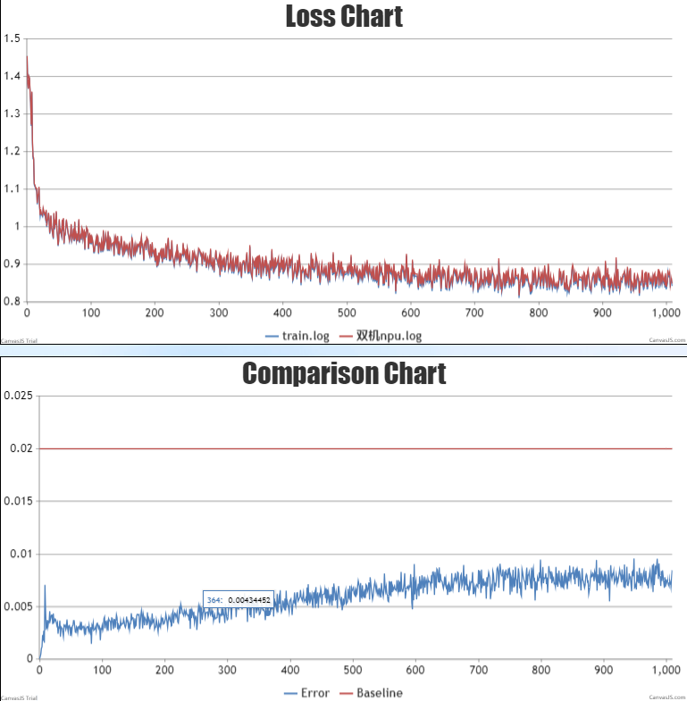

#  baichuan-13B


 
  

# 概述

## 简介

LLaMA Factory是一个易于使用的LLM微调框架。它使用一个简单的Web界面。用户仅需10分钟即可完成模型的自感知微调。支持LLAMA、Falcon等多种主流开源模型。此外，还提供了语言、模型路径等自定义选项。训练完成后，您可以评估模型效果，并将模型导出给其他系统使用。

- 参考实现 ：

  ```
  url=https://github.com/hiyouga/LLaMA-Factory/commits/v0.2.0
  commit_id=7a5318804870b1f2bedec8d4a676e465b48d5c3e
  ```

- 适配昇腾 AI 处理器的实现：

  ```
  url=https://gitee.com/ascend/ModelZoo-PyTorch.git
  code_path=PyTorch/built-in/foundation
  ```

# 准备训练环境
## 环境配置

默认配置需要每张卡有60G以上空闲内存。

- 当前模型支持的 PyTorch 版本和已知三方库依赖如下表所示。

| Hardware |      Value      |
| :------: | :-------------: |
|   NPU    | 8 x Ascend NPUs |


|         Software          |                 Version                  |                             link                             |
| :-----------------------: | :--------------------------------------: | :----------------------------------------------------------: |
|          Python           |      3.8.18                  |                              -                               |
|          driver           |              23.0.RC3.B050               | [link](https://support.huawei.com/enterprise/zh/ascend-computing/ascend-hdk-pid-252764743/software/261159045?idAbsPath=fixnode01%7C23710424%7C251366513%7C22892968%7C252764743) |
|         firmware          |              7.0.t8.0.b214               | [link](https://support.huawei.com/enterprise/zh/ascend-computing/ascend-hdk-pid-252764743/software/261159045?idAbsPath=fixnode01%7C23710424%7C251366513%7C22892968%7C252764743) |
|           CANN            |   Ascend-cann-toolkit_7.0.RC1.1_linux    | [link](https://support.huawei.com/carriersoftwareapply/softwareApp?nid=PSW2001680585&pbi=PBI1-261422362&swlang=zh&supPbi=PBI1-251168373&path=PBI1-21430725/PBI1-21430756/PBI1-22892969/PBI1-23710427/PBI1-251168373) |
| binary arithmetic package | Ascend-cann-kernels-910b_7.0.RC1.1_linux | [link](https://support.huawei.com/carriersoftwareapply/softwareApp?nid=PSW2001680596&pbi=PBI1-261422362&swlang=zh&supPbi=PBI1-251168373&path=PBI1-21430725/PBI1-21430756/PBI1-22892969/PBI1-23710427/PBI1-251168373) |
|           torch           |                  2.0.1                  | [link]() |
|         torch_npu         |               2.0.1               | [link]() |
## 配置双机通信环境

1.安装pdsh
url： https://github.com/chaos/pdsh/tree/pdsh-2.29


**安装**
```python
git clone https://github.com/chaos/pdsh/archive/refs/tags/pdsh-2.29.tar.gz

tar -zxvf pdsh-2.29.tar.gz
cd pdsh-2.29
./configure --with-ssh --with-rsh --with-mrsh --with-mqshel --with-qshell  --with-dshgroups --with-machines=/etc/pdsh/machines  --without-pam

make
make install
```
安装完成后，执行`pdsh -h`命令。显示如下信息，表示安装成功。
```shell
# pdsh -h
Usage: pdsh [-options] command ...
-S                return largest of remote command return values
-h                output usage menu and quit
-V                output version information and quit
-q                list the option settings and quit
-b                disable ^C status feature (batch mode)
-d                enable extra debug information from ^C status
-l user           execute remote commands as user
-t seconds        set connect timeout (default is 10 sec)
-u seconds        set command timeout (no default)
-f n              use fanout of n nodes
-w host,host,...  set target node list on command line
-x host,host,...  set node exclusion list on command line
-R name           set rcmd module to name
-M name,...       select one or more misc modules to initialize first
-N                disable hostname: labels on output lines
-L                list info on all loaded modules and exit
-g groupname      target hosts in dsh group "groupname"
-X groupname      exclude hosts in dsh group "groupname"
-a                target all nodes
available rcmd modules: ssh,rsh,exec (default: rsh)

```

2.双机通信配置

首先，我们需要编辑两台服务器的/etc/hosts文件，添加两台服务器的IP地址，并将ip1和ip2替换为两台服务器的实际IP地址

```shell
vim /etc/hosts
```
```shell
ip1 node1
ip2 node2
```

然后，我们需要执行以下命令来生成sshkey。

```shell
ssh-keygen -t rsa
```
接着，将ssh-key拷贝到每个节点，本机也要拷贝。

```shell
ssh-copy-id root@ip1
ssh-copy-id root@ip2
```
然后，在每个节点上运行以下代码。如果不需要输入密码，则表示配置成功。然后执行`exit`退出。

```shell
ssh root@ip1
ssh root@ip2
```

## 安装基础依赖

1. 准备代码:
```shell
git clone https://github.com/hiyouga/LLaMA-Factory/tree/7a5318804870b1f2bedec8d4a676e465b48d5c3e
cd ${模型文件夹名称}
mkdir output_sft 
mkdir logs
```

2. 创建conda环境

```bash
# python3.8
conda create -n test python=3.8
conda activate test

# install torch and torch_npu
pip install torch2.0.1-cp38-XXX.whl
pip install torch_npu-2.0.1-XXX.whl
pip install apex-0.1_ascend_XXX.whl

# install deepspeed and deepspeed_npu
pip install deepspeed==0.9.2
git clone https://gitee.com/ascend/DeepSpeed.git -b v0.9.2 deepspeed_npu
cd deepspeed_npu
pip3 install -e ./
cd ..


# install other packages
pip install -r requirements.txt 

```
3. 准备预训练权重

用户从[链接](https://huggingface.co/baichuan-inc/Baichuan-13B-Base/tree/main) 自行获取模型配置文件和权重文件，并放于model_weight 目录下，微调依赖该模型权重。
```shell
mkdir model_weight 
cd ./model_weight

wget https://huggingface.co/baichuan-inc/Baichuan-13B-Base/resolve/main/config.json
wget https://huggingface.co/baichuan-inc/Baichuan-13B-Base/resolve/main/configuration_baichuan.py
wget https://huggingface.co/baichuan-inc/Baichuan-13B-Base/resolve/main/generation_config.json
wget https://huggingface.co/baichuan-inc/Baichuan-13B-Base/resolve/main/modeling_baichuan.py
wget https://huggingface.co/baichuan-inc/Baichuan-13B-Base/resolve/main/pytorch_model-00001-of-00003.bin
wget https://huggingface.co/baichuan-inc/Baichuan-13B-Base/resolve/main/pytorch_model-00002-of-00003.bin
wget https://huggingface.co/baichuan-inc/Baichuan-13B-Base/resolve/main/pytorch_model-00003-of-00003.bin
wget https://huggingface.co/baichuan-inc/Baichuan-13B-Base/resolve/main/pytorch_model.bin.index.json
wget https://huggingface.co/baichuan-inc/Baichuan-13B-Base/resolve/main/quantizer.py
wget https://huggingface.co/baichuan-inc/Baichuan-13B-Base/resolve/main/special_tokens_map.json
wget https://huggingface.co/baichuan-inc/Baichuan-13B-Base/resolve/main/tokenization_baichuan.py
wget https://huggingface.co/baichuan-inc/Baichuan-13B-Base/resolve/main/tokenizer_config.json
wget https://huggingface.co/baichuan-inc/Baichuan-13B-Base/resolve/main/tokenizer.model

cd ..
```

4. 准备数据集

项目的"./data"路径下已存在预训练所需数据集。

```shell
data/
├── alpaca_data_en_52k.json
├── alpaca_data_zh_51k.json
├── alpaca_gpt4_data_en.json
├── alpaca_gpt4_data_zh.json
├── belle_multiturn
│   └── belle_multiturn.py
├── comparison_gpt4_data_en.json
├── comparison_gpt4_data_zh.json
├── dataset_info.json
├── example_dataset
│   ├── example_dataset.py
│   └── examples.json
├── hh_rlhf_en
│   └── hh_rlhf_en.py
├── lima.json
├── oaast_rm.json
├── oaast_rm_zh.json
├── oaast_sft.json
├── oaast_sft_zh.json
├── README.md
├── README_zh.md
├── self_cognition.json
├── sharegpt_zh_27k.json
├── ultra_chat
│   └── ultra_chat.py
└── wiki_demo.txt

```


# 启动训练 


1、将项目根目录下的`run_baichuan_sft_2m.sh`、`ds_config_zero2.json`、`hostfile`文件拷贝到`${模型文件夹名称}`路径下。
```shell
cp ../run_baichuan_sft_2m.sh .
cp ../ds_config_zero2.json .
cp ../hostfile .
```

2、启动脚本
该模型双机16卡微调，执行如下命令启动训练。
```shell
sh run_baichuan_sft_2m.sh
``` 
模型训练部分参数说明如下：

   ```
--deepspeed                     //使用DeepSpeed分布式训练框架。
--dataset                       //指定训练数据集。
--finetuning_type               //指定微调类型。
--output_dir                    //指定输出目录。
--per_device_train_batch_size   //每个设备的训练批次大小。
--gradient_accumulation_steps   //梯度累积步数。
--learning_rate                 //学习率。
--num_train_epochs              //训练的轮数。
--fp16                          //使用fp16精度浮点数进行训练。

   ```
   **注**：为确保双机训练成功，请保证双机环境及路径一致，包括项目路径、conda环境、cann和驱动等。
训练完成后，权重文件保存`--output_dir`参数指定的路径下，并输出模型训练相关信息。

# 训练结果展示

## 性能结果展示
**表 1**  双机16卡训练结果展示

| Device    |  total epochs | train loss | train samples per second | train steps per second| 
| --------- | ---------------- | ----------------------------- | ---------------------------- | ------------------------- | 
| NPUs      |  10.0  | 0.9032  |  11.378     |   0.022     | 
| Reference |  10.0  | 0.9031  |  9.3     |     0.018   | 


## 精度结果展示

NPU vs Reference loss对比.

绝对误差：最大值0.0085，平均值0.0052
相对误差：最大值0.0096，平均值0.0059

NPU运行平稳，资源占用稳定，中间无报错，Loss有下降趋势，收敛速度符合预期。平均损失的相对误差小于2%。精度满足要求。
- 双机16卡loss对比图


# FAQ

**为适配V0.2.0的代码，在配置完运行环境后做如下修改：**

1、检测下面python包并安装对应版本。
```python
pip install trl==0.7.2
pip install transformers==4.31.0
pip install transformers_stream_generator decorator absl-py cloudpickle synr==0.5.0 tornado
```

2、修改deepspeed版本检测。

  - 注释 `${conda环境路径}/lib/python3.8/site-packages/transformers/deepspeed.py` line65的deepspeed版本检测代码。

  - 将 `${conda环境路径}/lib/python3.8/site-packages/accelerate/accelerator.py` line296修改为`if compare_versions("deepspeed", "<", "0.9.2"):`

3、使用项目`utils`目录下的`train_bash.py`文件替换`./${模型文件夹名称}/src`路径下的`train_bash.py`.
4、使用项目`utils`目录下的`misc.py`文件替换`./${模型文件夹名称}/src/llmtuner/extras`路径下的`misc.py`.
5、使用项目`utils`目录下的`modeling_baichuan.py`文件替换`./${模型文件夹名称}/model_weight`路径下的`modeling_baichuan.py`.