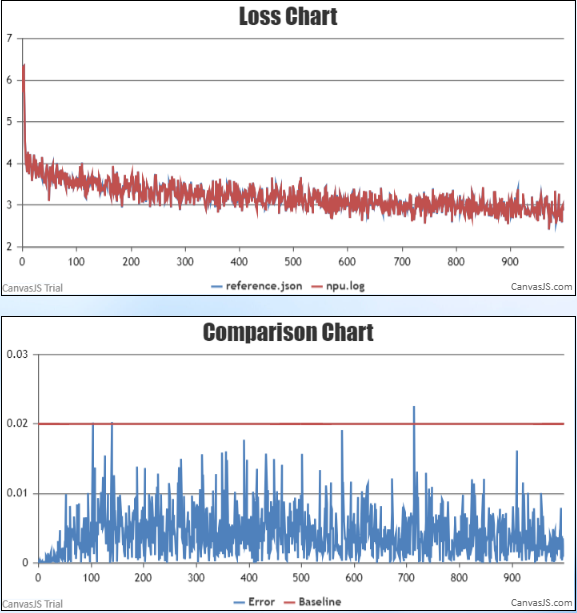

#  Contents

- [ChatGLM2-6B](#contents)
  
  - [Training](#pre-training)
  - [Script](#script)
  - [Performance](#performance)
    - [Machine performance](#machine-performance)
    - [Accuracy of the loss](#accuracy-of-the-loss)
  - [FAQ](#FAQ)
  
  

# ChatGLM2-6B

## Training

Here's a hardware summary of pre-training ChatGLM2-6B:

| Hardware |      Value      |
| :------: | :-------------: |
|   NPU    | 8 x Ascend NPUs |

Here's a software summary of pre-training ChatGLM2-6B: 


|         Software          |                 Version                  |                             link                             |
| :-----------------------: | :--------------------------------------: | :----------------------------------------------------------: |
|          Python           |                  3.7.16                  |                              -                               |
|          driver           |              23.0.RC3.B050               | [link](https://support.huawei.com/enterprise/zh/ascend-computing/ascend-hdk-pid-252764743/software/261159045?idAbsPath=fixnode01%7C23710424%7C251366513%7C22892968%7C252764743) |
|         firmware          |              7.0.t8.0.b214               | [link](https://support.huawei.com/enterprise/zh/ascend-computing/ascend-hdk-pid-252764743/software/261159045?idAbsPath=fixnode01%7C23710424%7C251366513%7C22892968%7C252764743) |
|           CANN            |   Ascend-cann-toolkit_7.0.RC1.1_linux    | [link](https://support.huawei.com/carriersoftwareapply/softwareApp?nid=PSW2001680585&pbi=PBI1-261422362&swlang=zh&supPbi=PBI1-251168373&path=PBI1-21430725/PBI1-21430756/PBI1-22892969/PBI1-23710427/PBI1-251168373) |
| binary arithmetic package | Ascend-cann-kernels-910b_7.0.RC1.1_linux | [link](https://support.huawei.com/carriersoftwareapply/softwareApp?nid=PSW2001680596&pbi=PBI1-261422362&swlang=zh&supPbi=PBI1-251168373&path=PBI1-21430725/PBI1-21430756/PBI1-22892969/PBI1-23710427/PBI1-251168373) |
|           torch           |                  1.11.0                  | [link](https://pytorch-package.obs.cn-north-4.myhuaweicloud.com/pta/Daily/v1.11.0/20230915.2/pytorch_v1.11.0_py37.tar.gz) |
|         torch_npu         |               1.11.0.post5               | [link](https://gitee.com/ascend/pytorch/archive/refs/tags/v5.0.rc3.1-pytorch1.11.0.tar.gz) |


### Script

1. Clone the repository to your local server:
```shell
git clone https://gitee.com/ascend/ModelZoo-PyTorch.git
cd ModelZoo-PyTorch/PyTorch/built-in/foundation/ChatGLM2-6B

```

2. Build environment

```bash
# python3.7
conda create -n test python=3.7
conda activate test

# install torch and torch_npu
pip install torch-1.11.0-cp37-cp37m-manylinux2014_aarch64.whl
pip install torch_npu-1.11.0.post4_XXXXXX-cp37-cp37m-linux_aarch64.whl
pip install apex-0.1_ascend_XXXXXX-cp37-cp37m-linux_aarch64.whl

# install deepspeed and deepspeed_npu
pip install deepspeed==0.9.2
git clone https://gitee.com/ascend/DeepSpeed.git -b v0.9.2 deepspeed_npu
cd deepspeed_npu
pip3 install -e ./
cd ..


# install other packages
pip install -r requirements.txt 

# 使用fix文件夹下的tranining_args.py替换路径下transformers/tranining_args.py
# cp fix/utils.py /root/miniconda3/envs/conda环境名/lib/python3.7/site-packages/transformers/generation/
```
3. Prepare pretrained weights
    1)Download the ChatGLM2-6B checkpoint from [here]([THUDM/chatglm2-6b at v1.0 (huggingface.co)](https://huggingface.co/THUDM/chatglm2-6b/tree/v1.0)) ; After downloading, place it in the "model" directory . 

  2)Please Do NOT overwrite modeling_chatglm.py

  The "model" directory is as follows

```shell
  ├── model
      ├──config.json
      ├──configuration_chatglm.py
      ├──ice_text.model
      ├──pytorch_model-00001-of-00007.bin
      ├──pytorch_model-00002-of-00007.bin
      ├──pytorch_model-00003-of-00007.bin
      ├──pytorch_model-00004-of-00007.bin
      ├──pytorch_model-00005-of-00007.bin
      ├──pytorch_model-00006-of-00007.bin
      ├──pytorch_model-00007-of-00007.bin
      ├──pytorch_model.bin.index.json
      ├──quantization.py
      ├──test_modeling_chatglm.py
      ├──tokenization_chatglm.py
      ├──tokenizer_config.json
      ├──tokenizer.model
      ├──modeling_chatglm.py
```

4. Prepare dataset

1).Download the ChatGLM2-6B datasets from [here](https://drive.google.com/file/d/13_vf0xRTQsyneRKdD1bZIr93vBGOczrk/view?usp=sharing) ；Place the decompressed `AdvertiseGen` in the "ptuning" directory.
The data set is as follows：

```
├── AdvertiseGen
      ├──train.json
      ├──dev.json
```

2)Config ChatGLM2-6B Process script : ptuning/preprocess.sh

```shell
# modify the script according to your own  ascend-toolkit path
source env_npu.sh

# for preprocess training datasets
--do_train \
--max_source_length 4096 \ #for example 
--max_target_length 4096 \  
```
```shell
# for preprocess predict datasets
--do_predict \
--max_source_length 256 \
--max_target_length 256
```
3).Process datasets

```shell
  # process datasets                              
  bash preprocess.sh
```


5. Config ChatGLM2-6B training script : ptuning/ds_train_fintune.sh

```shell
# modify the script according to your own  ascend-toolkit path
source env_npu.sh

# modify script according to your own needs
--model_name_or_path ../model/ \  #model path
--max_source_length 4096 \
--max_target_length 4096 \  #should align with the processed dataset
```

6. Launch ChatGLM2-6B  training script :ptuning/ds_train_fintune.sh

   该模型P-Tuning v2支持单机单卡，全参数fintune支持单机8卡。

-  全参数finetune， 启动8卡微调。


```shell
bash ds_train_fintune.sh
```

- P-Tuning v2

  启动P-Tuning v2。

  ```
  bash train.sh
  ```
7. 全参数finetune验证

    运行以下命令

    ```
    cd /${模型文件夹名称}/ptuning
    bash evaluate_fintune.sh
	```

### Performance

#### Machine performance

The performance of ChatGLM2-6B in **Ascend NPU** and **Reference**:

| Device    | Model       | total Iterations | throughput rate (samples/s/p) | throughput rate (tokens/s/p) | single-step time (s/step) | floating point operation (TFLOPs/s) |
| --------- | ----------- | ---------------- | ----------------------------- | ---------------------------- | ------------------------- | ----------------------------------- |
| NPUs      | ChatGLM2-6B | 1000             | 待补充                        | 1927                         | 4.25                      | 待补充                              |
| Reference | ChatGLM2-6B | 1000             | 待补充                        | 1820                         | 4.5                       | 待补充                              |

评估结果展示表

| 评估项  |   NPU   |   GPU   |
| :-----: | :-----: | :-----: |
| BLEU-4  | 8.0174  | 7.5779  |
| ROUGE-1 | 31.5737 | 31.0244 |
| ROUGE-2 | 7.2976  | 7.1179  |
| ROUGE-l | 24.8196 | 24.7112 |

说明：该结果是step=1000的验证结果。

#### Accuracy of the loss

NPU vs Reference loss.

The NPU runs smoothly, the resource usage is stable, no errors are reported in the middle of the process, the Loss is on a decreasing trend, and the convergence speed is as expected. The relative error of the average loss is less than 2%. The precision meets the requirements.



## FAQ

1. 报错提示deepspeed.py需要版本大于等于0.6.5

   ```
   # 关闭版本检测（如安装0.9.2版本无需此操作）
   # 若遇到该报错
   pip show transformers
   # 复制Location路径
   # 使用fix文件夹下的deepspeed.py替换路径下transformers/deepspeed.py
   ```

2. 加载参数阶段有卡死现象

   ```
   删除root下的cache目录，重新运行
   ```

3. 单卡阶段报embedding_dense_grad算子错误

   ```
   enbedding当前版本，不支持动静合一，静态有部分shape不支持,新版本已修复
   # 若遇到该报错
   修改main.py文件
   torch.npu.set_compile_mode(jit_compile=False)
   ```

4. 提示so文件错误

   ```
   提示so文件找不到
   # 若遇到该报错
   全局搜索so的位置，然后导入环境变量
   export LD_LIBRARY_PATH=/usr/:$LD_LIBRARY_PATH
   ```

5. eval提示scaledsoftmax报错

   ```
   算子shape泛化性还有问题
   # 若遇到该报错
   搜索output文件夹生成的modeling_chatglm.py文件，
   self.scale_mask_softmax 设置为false
   ```

```
* 规避推理错误：

`cp fix/utils.py /root/miniconda3/envs/conda环境名/lib/python3.7/site-packages/transformers/generation/`
```

1. 微调时出现AttributeError或RuntimeError

   module 'torch_npu' has no attribute 'npu_rotary_mul' 或

   RuntimeError:Error!, The last dimension of input tensor shoule be within the range of [32,2048] and be divisible by32

   ```
   修改modeling_chatglm.py文件:
   USE_NPU_ROTARY=False
   USE_SCALED_SOFTMAX=False
   ```

   PS: 设置为True能提高性能

2. 如果cann不支持flash_attention

    报错提示为module 'torch_npu' has no attribute 'npu_flash_attention'

```
修改modeling_chatglm.py文件:
USE_FLASH=False
```

​       PS: 设置为True能提高性能

