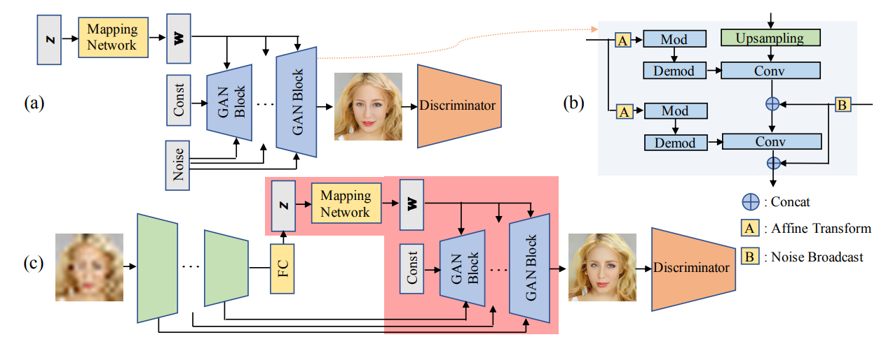

# GPEN

包含GPEN的NPU平台实现。  

[GPEN](https://arxiv.org/pdf/2105.06070.pdf) ：

 

GPEN模型的训练需要FFHQ数据集，在[Data Preparation](#data-preparation)中有更详细的描述。

我们提供了部分预训练模型，请参阅 [Models](#models) 了解我们提供的模型，并参阅 [Getting Started](#getting-started) 了解有关训练和评估的说明。

```angular2html
@inproceedings{yang2021gan,
  title={Gan prior embedded network for blind face restoration in the wild},
  author={Yang, Tao and Ren, Peiran and Xie, Xuansong and Zhang, Lei},
  booktitle={Proceedings of the IEEE/CVF Conference on Computer Vision and Pattern Recognition},
  pages={672--681},
  year={2021}
}
```


## Updates

- [GPEN](#gpen)
  - [Updates](#updates)
  - [Installation](#installation)
  - [Code Structure](#code-structure)
  - [Data Preparation](#data-preparation)
  - [Models](#models)
  - [Getting Started](#getting-started)
    - [Training](#training)
    - [Testing](#testing)
  - [Reference:](#reference)


## Installation

环境要求：
* Linux 环境 Python 版本 >= 3.7
* [PyTorch](https://pytorch.org/get-started/locally/) 版本 >= 1.5
* 具体参考requirements.txt


## Code Structure
- 具体请参考相关文档
- **cann**: 包含cann运行结果
- **examples**: 包含部分示例代码
- **face_detect**:包含面部识别代码
- **face_model**:包含gpen模型
- **face_parse**: 包含面部分割代码
- **profiler**:包含profiling运行代码和结果
- **weights**:包含预训练模型
- **training**:包含部分模型训练所需代码
- **train_simple.py**:训练核心代码
- **run.sh**:训练脚本
- **requirements.txt**:环境配置


## Data Preparation

模型训练需要FFHQ数据集:

- [FFHQ](https://github.com/NVlabs/ffhq-dataset):  FFHQ全称Flickr-Faces-High-Quality（Flickr-Faces-HQ），最初是作为生成式对抗网络(GAN)的基准创建的，也用于StyleGAN的训练数据集中，并由英伟达于2019年开源。FFHQ是一个高质量的人脸数据集，包含1024×1024分辨率的70000张PNG格式高清人脸图像，在年龄、种族和图像背景上丰富多样且差异明显，在人脸属性上也拥有非常多的变化，拥有不同的年龄、性别、种族、肤色、表情、脸型、发型、人脸姿态等，囊盖普通眼镜、太阳镜、帽子、发饰及围巾等多种人脸周边配件，因此该数据集也是可以用于开发一些人脸属性分类或者人脸语义分割模型的。FFHQ的图像从Flickr上爬取，且均有许可才会下载，并使用了dlib进行人脸对齐和裁剪，之后使用算法移除了一些非真实人脸如雕像、画作及照片等图像。 


## Models

我们在`weights`目录下中提供了部分可供下载的预训练模型，命名按照训练epoch数保存。


## Getting Started

### Training

1. 直接运行训练脚本**run.sh**

2. 进入仓库运行以下代码进行训练

   ```angular2html
   python3 train_simple.py --size 512 --channel_multiplier 2 --narrow 1 --ckpt weights --sample results --batch 2 --path ../ffhq_gpen/images1024x1024_align
   ```

部分参数说明：

- size：分辨率
- ckpt：模型保存目录
- batch：batchsize
- path：ffhq数据集目录


### Testing

1. 在`weights`目录下选择合适的预训练模型

2. 运行脚本

   ```angular2html
   python3 demo.py --task FaceEnhancement --model 110000 --in_size 512 --channel_multiplier 2 --narrow 1 --use_sr --sr_scale 4 --use_cuda --save_face --indir examples/imgs --outdir examples/outs-bfr
   ```

部分参数说明：

- task：任务类型
- model：预训练模型位置(在`weights`目录下的位置)
- in_size：输入图像分辨率
- indir：输入图像目录
- outdir：输出图像目录


## Reference:

code:  [yangxy/GPEN (github.com)](https://github.com/yangxy/GPEN) 

paper: [GPEN](https://arxiv.org/pdf/2105.06070.pdf) 


# Statement

For details about the public address of the code in this repository, you can get from the file public_address_statement.md